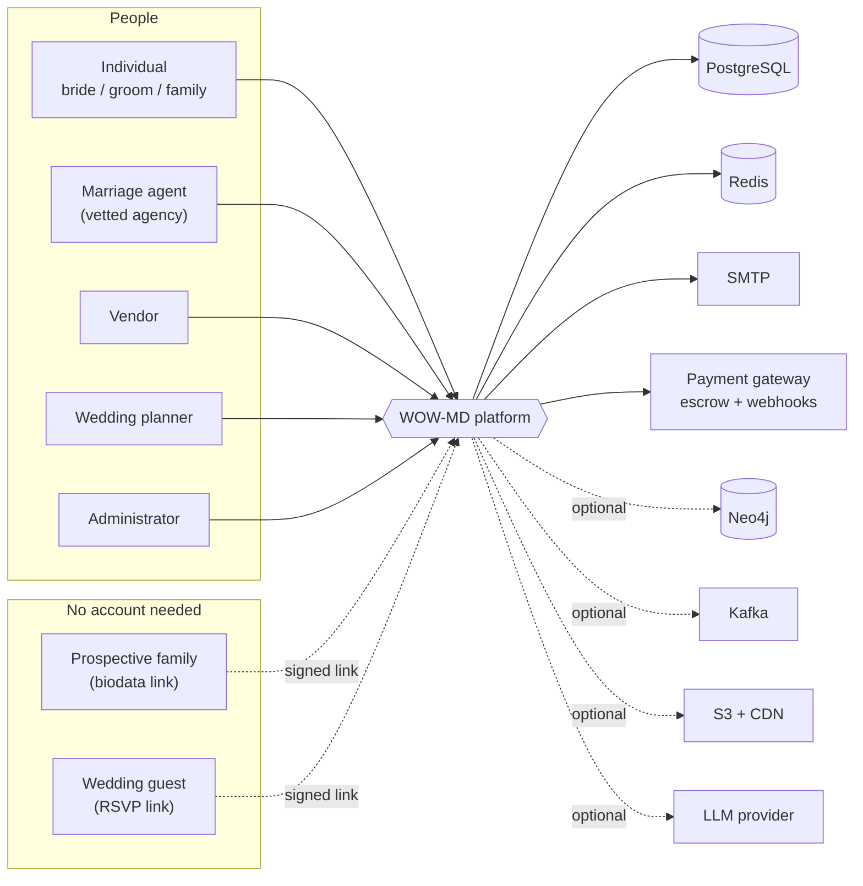
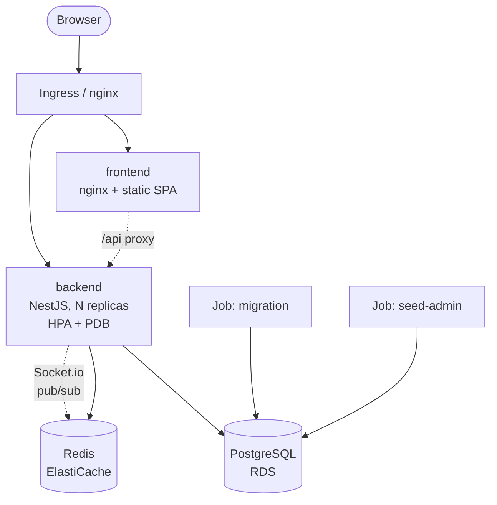
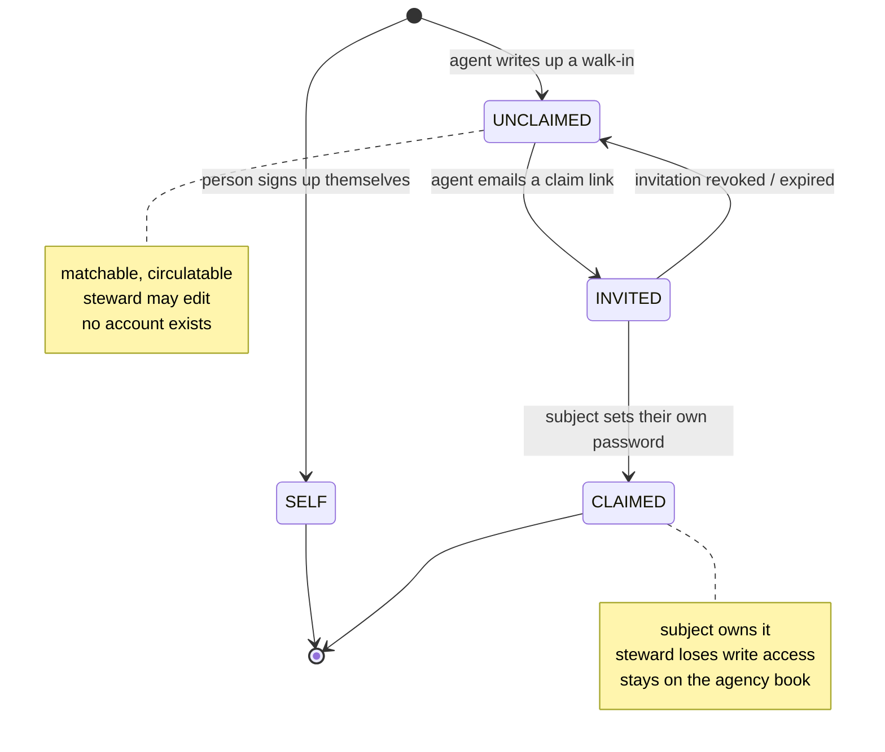
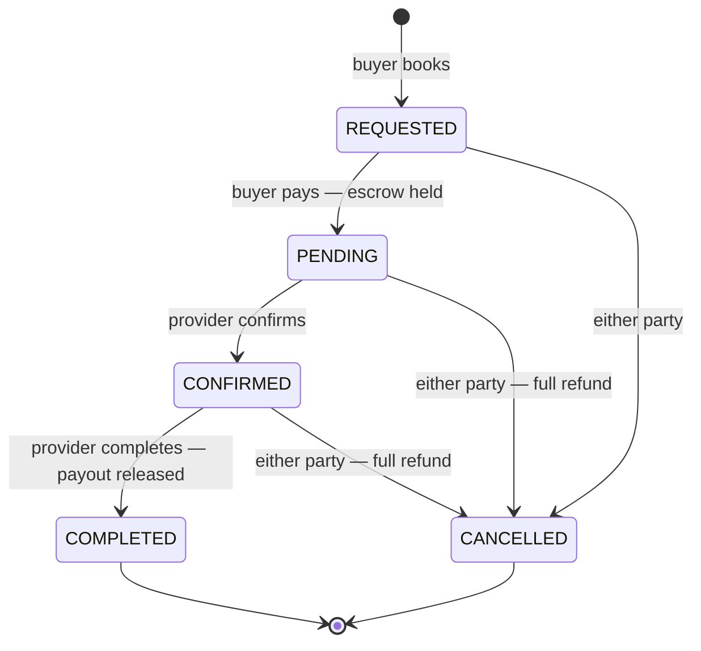
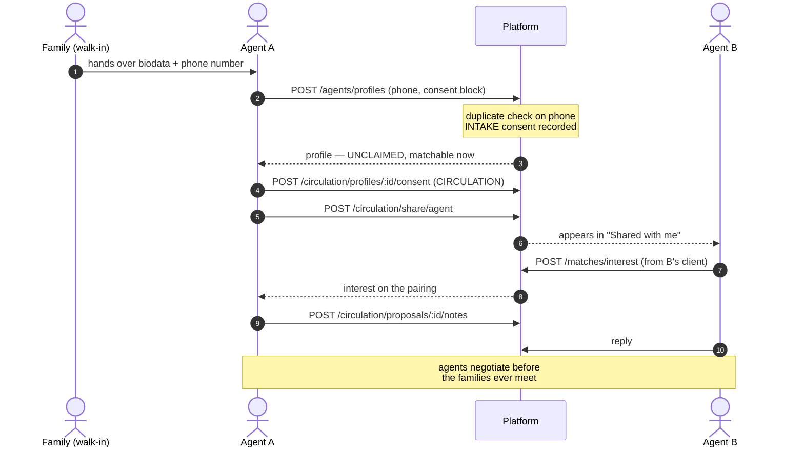
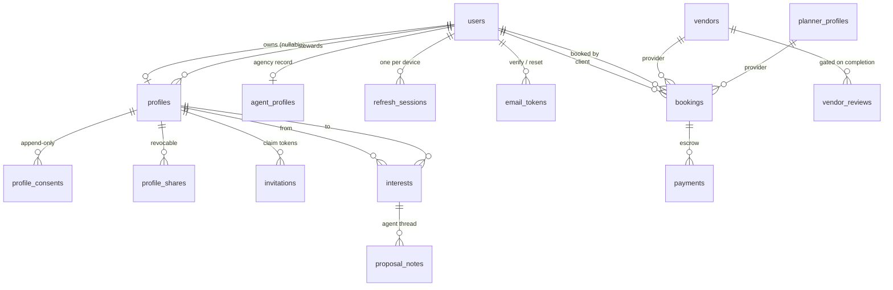

# WOW-MD architecture

Combined high-level, system-level and low-level design for the whole repository.

It runs top-down: the system in context, then the subsystems and how they
interact, then the tables, routes and algorithms. Each part stands alone — you
can enter at [§3.1](#31-data-model) without reading the rest.

**How to read the numbering.** The three parts are the three altitudes of a
design document. **1** is what the system is and why. **2** is how the pieces
fit and talk. **3** is what you type. Sub-numbers are stable; cite them.

| | | | |
|---|---|---|---|
| **7** personas | **40** permissions | **26** modules | **31** tables |
| **133** routes | **5** migrations | **351** checks | **18.1k** lines TS |

---

## Contents

- [0. Orientation](#0-orientation)
- [1. High-level design](#1-high-level-design)
  - [1.1 The domain](#11-the-domain-and-the-assumption-it-overturns) ·
    [1.2 System context](#12-system-context) ·
    [1.3 Personas and invariants](#13-personas-and-the-four-invariants) ·
    [1.4 Architecture style](#14-architecture-style-a-modulith-deliberately) ·
    [1.5 Deployment topology](#15-deployment-topology) ·
    [1.6 Technology choices](#16-technology-choices)
- [2. System-level design](#2-system-level-design)
  - [2.1 Module map](#21-module-map) ·
    [2.2 Identity model](#22-identity-a-profile-is-not-an-account) ·
    [2.3 Authorization](#23-authorization-two-layers-that-answer-different-questions) ·
    [2.4 Consent and circulation](#24-consent-and-circulation) ·
    [2.5 Money and escrow](#25-money-escrow-commission-webhooks) ·
    [2.6 Cross-cutting](#26-cross-cutting-concerns) ·
    [2.7 End-to-end flows](#27-end-to-end-flows)
- [3. Low-level design](#3-low-level-design)
  - [3.1 Data model](#31-data-model) ·
    [3.2 Permission matrix](#32-permission-matrix) ·
    [3.3 API surface](#33-api-surface) ·
    [3.4 Request lifecycle](#34-request-lifecycle) ·
    [3.5 Token design](#35-token-design) ·
    [3.6 Key algorithms](#36-key-algorithms) ·
    [3.7 Configuration](#37-configuration)
- [4. Operations](#4-operations)
- [5. Quality](#5-quality)
- [6. Known gaps](#6-known-gaps)

---

## 0. Orientation

A matrimony and wedding-services marketplace built for how Indian agencies
actually work: the family walks into the office and hands over their details,
and the agent circulates the biodata looking for a match. Everything
downstream — the identity model, the permission system, the consent rules —
falls out of that one fact.

---

## 1. High-level design

> What the system is, and why it is shaped this way.

### 1.1 The domain, and the assumption it overturns

Most matrimony software assumes the person seeking a match signs up, fills in a
form and searches. In the Indian market that is frequently not what happens. A
family visits a marriage agent's office, hands over a printed biodata and a
phone number, and the agent takes it from there — writing the profile up,
passing it to other agents, sending it to prospective families, and brokering
the introduction.

Two consequences run through the whole design:

1. **A profile is not an account.** The profile exists and is matchable long
   before — often instead of — anyone logging in.
2. **Circulation is a first-class operation**, with the consent machinery that
   responsibly passing someone else's details around demands.

Around that core sits the rest of the wedding journey: a vendor and planner
marketplace with escrow, an auto-generated wedding timeline, multi-ceremony
guest management, honeymoon itineraries, and shareable photo albums.

### 1.2 System context

Five kinds of human touch the system, plus two who never get an account at
all — the wedding guest, and the family whose biodata is being circulated. Both
are addressed by signed single-purpose links rather than credentials.



Dotted dependencies are feature-flagged off by default and degrade to no-ops.

### 1.3 Personas and the four invariants

| Account type | Role(s) | Purpose | Vetted? |
| --- | --- | --- | --- |
| Individual | `bride`, `groom`, `family` | Own profile, matchmaking, buying services. A `family` account may additionally steward a relative's profile. | no |
| Marriage agent | `agent` | Takes walk-in details, builds and circulates profiles, proposes matches, books on a client's behalf. | admin approval |
| Vendor | `vendor` | Sells wedding services; confirms and completes bookings; paid from escrow. | listing approval |
| Wedding planner | `planner` | Sells planning packages; co-manages the plans they are engaged on. | listing approval |
| *not offered publicly* | `admin` | Approvals, analytics, disputes, suspensions, audit trail. | seeded out of band |

Everything in [Part 2](#2-system-level-design) exists to hold these true, and
every one is enforced server-side on every request:

1. **Only individuals and agents can buy.** Vendors and planners sell; they
   never place bookings or browse matches.
2. **Only individuals take part in matchmaking.** An agent participates
   strictly under the identity of a client profile they manage.
3. **Nobody creates an account for someone else.** An agent builds the
   *profile*; the person themselves sets the password when they accept an
   invitation.
4. **Nothing leaves the agency without consent.** Holding a family's details
   and circulating them are separate permissions, recorded separately.

### 1.4 Architecture style: a modulith, deliberately

The backend is a single NestJS application with hard internal module
boundaries — a modulith, not microservices. For a platform at this stage that is
the right trade: one deployment, one database, atomic transactions across
booking and payment, and no distributed-transaction problem to solve before
there is traffic to justify it.

The boundaries are real, though. Each module owns its entities and exposes a
service; cross-module reads go through that service or through an explicitly
imported repository, never through a shared "models" dumping ground. A
transactional outbox (`outbox_events`) already decouples domain events from
their consumers, so extracting a module later means changing a consumer's
transport, not unpicking its data.

| Layer | Contains |
| --- | --- |
| **Edge** | nginx — serves the SPA, proxies `/api` and the Socket.io upgrade |
| **HTTP** | Controllers, DTOs, global `ValidationPipe` (whitelist + forbid unknown), four chained guards |
| **Domain** | 17 feature modules — services own the business rules and every ownership check |
| **Platform** | 9 shared modules — audit, mail, throttling, Redis, outbox, Neo4j, Kafka, health, websocket adapter |
| **Persistence** | TypeORM entities, hand-authored migrations, `synchronize: false` always |

Guards and validation sit above the domain so a service is never the first line
of defence, only the last.

### 1.5 Deployment topology

Two images. The backend is a multi-stage Node build that runs migrations then
boots; the frontend is a Vite build served by nginx. Local development is one
`docker compose up`; production is Kustomize-managed Kubernetes on
Terraform-provisioned AWS.



Redis is load-bearing three times over: cache, rate-limit counters, and the
Socket.io adapter that makes chat work across replicas.

**Statelessness.** Every backend replica is interchangeable. Sessions live in
Postgres, rate-limit counters in Redis, and nothing of consequence is held in
process memory — which is what makes the HPA safe and a rolling deploy
uneventful.

### 1.6 Technology choices

| Concern | Choice | Rationale |
| --- | --- | --- |
| API | NestJS 10 + TypeScript | DI and guard composition are what make a 40-permission matrix enforceable in one place rather than forty. |
| Data | PostgreSQL 16 + TypeORM | Relational integrity matters here — escrow, consent and shares all need real foreign keys. Migrations are hand-authored. |
| Cache / coordination | Redis 7 + ioredis | Read-through caching, shared rate-limit counters, webhook replay keys, Socket.io fan-out. |
| Realtime | Socket.io + Redis adapter | Chat must survive multiple replicas; the adapter routes to whichever pod holds the recipient. |
| Auth | JWT + Passport, TOTP | Short access token in memory, refresh token in an httpOnly cookie, per-device sessions in the database. |
| Frontend | React 18, Vite, Tailwind | 31 pages, permission-gated routing, TanStack Query for server state. |
| Infrastructure | Docker, Kustomize, Terraform | VPC, EKS, RDS, ElastiCache as code; HPA and PodDisruptionBudget in the manifests. |
| Optional | Neo4j, Kafka, S3, LLM | All behind `*_ENABLED` flags. Off by default, and every method degrades to a safe no-op. |

---

## 2. System-level design

> How the pieces fit together.

### 2.1 Module map

Nineteen domain modules and nine platform modules. Platform modules are
global — any domain module can inject audit or mail without re-importing a
transport.

**Domain**

| Module | Responsibility |
| --- | --- |
| `auth` | Registration, login, sessions, MFA, recovery |
| `users` | Own profile CRUD |
| `profile-details` | The matrimonial biodata, section by section, and Aadhaar verification |
| `verification` | Field verification requests, officers, support cases and settlements |
| `agents` | Agency record, managed profiles, client book |
| `invitations` | Claim tokens, account creation on accept |
| `circulation` | Consent, sharing, pool, proposals |
| `matchmaking` | Suggestions, interests, compatibility |
| `chat` | Threads, REST + WebSocket, access rules |
| `vendors` | Listings, search, gated reviews |
| `wedding-planners` | Planner listings and search |
| `bookings` | Lifecycle, escrow, commission, webhooks |
| `planner` | Wedding plan, timeline, tasks |
| `events` | Ceremonies, guests, RSVP links |
| `media` | Albums, presigned upload, shared links |
| `travel` | Destinations, packages, itineraries |
| `notifications` | Fan-out from domain events |
| `admin` | Approvals, analytics, disputes, audit |
| `ai` | Budget insight, recommendations, assistant |

**Platform**

| Module | Responsibility |
| --- | --- |
| `audit` | Append-only privileged-action trail |
| `mail` | log / smtp providers, templates |
| `throttling` | Redis storage, per-account tracker |
| `redis` | Cache-aside helper, raw client |
| `events` | Transactional outbox + processor |
| `messaging` | Kafka publisher (optional) |
| `neo4j` | Graph-ranked suggestions (optional) |
| `health` | Liveness and readiness probes |
| `websocket` | Redis Socket.io adapter |

### 2.2 Identity: a profile is not an account

This is the load-bearing idea. `users` holds credentials and a persona;
`profiles` holds a marriage profile. Either can exist without the other: a
vendor has an account and no marriage profile, and an agent-built profile has no
account until — and unless — its subject claims it.

`profiles.userId` is therefore **nullable**, which forces the second decision:
**matchmaking keys on profile ids, not user ids**.
`interests.fromProfileId` / `toProfileId` is what lets a profile with no account
behind it send and receive interests from the day it is written up. Bookings
still key on accounts, because escrow needs a real account to refund to.



Claiming is optional; a great many profiles stay agent-managed forever.

### 2.3 Authorization: two layers that answer different questions

Controllers declare a *capability*, never a list of roles. A 40-entry matrix
maps each role to its permissions, so adding a persona is one row rather than a
sweep across eighteen controllers.

But a guard cannot answer *is this particular record theirs?* — that needs a
database read. So there are two layers, and skipping the second is precisely
what produced the IDOR defects in [§5.2](#52-defects-this-design-closed).

| Layer | Question it answers | Lives in | Example refusal |
| --- | --- | --- | --- |
| `PermissionsGuard` | May this *kind* of account attempt this at all? | One global guard | A bride calling `/bookings/:id/complete` |
| Service check | Is *this* record theirs? | Each domain service | Vendor B completing vendor A's booking |

Ownership itself is written in exactly three places, and every path routes
through one of them. That is the rule that keeps the system auditable:

| Choke point | Grants | Used by |
| --- | --- | --- |
| `MatchmakingService.resolveSubject` | Act *as* a profile — own it, steward it, or admin | Every matchmaking path |
| `AgentsService.assertManages` | Act for a client *account* | Bookings, plans, client reads |
| `SharingService.circulatable` | Circulate a profile — control it *and* hold consent | All five circulation paths |

### 2.4 Consent and circulation

Agreeing that an agency may *hold* your details is not agreeing that they may
*pass them around*. Those are recorded as two separate scopes, and only the
second expires.

Each record captures the method, who gave it and their relationship to the
subject — in this market a parent very often speaks for the person — a callback
number, the date, the capturing agent, and notes. Records are **append-only**: a
re-confirmation writes a new row, so the history of what was agreed survives.

| Scope | Covers | Expires | Blocks what |
| --- | --- | --- | --- |
| `INTAKE` | The agency holding and using the details internally | never | Creating the profile at all |
| `CIRCULATION` | The profile leaving the agency, by any route | 365 days, configurable | All five paths below |

Circulation itself is five operations. Every one checks consent, produces a
**revocable record**, and grants **read only** — never edit, never act-as.

| # | Path | Recipient |
| --- | --- | --- |
| 1 | Share with an agency | Another approved agent, who can propose from their own book |
| 2 | Share with a user | A family that already has an account and is looking themselves |
| 3 | Biodata link | Anyone with the link — no account. The WhatsApp case. |
| 4 | Network pool | Every approved agency, by search |
| 5 | Printed biodata | The same link, rendered for paper |

**Withdrawal genuinely withdraws.** Revoking circulation consent pulls the
profile out of the network pool in the same transaction, and kills links already
in the wild — because consent is re-checked when a link is *opened*, not only
when it is created. The agency can always answer *who has seen my client's
details*, including whether each link was ever opened.

Full detail in [CIRCULATION.md](CIRCULATION.md).

### 2.5 Money: escrow, commission, webhooks

A booking is an explicit state machine. The buyer pays into escrow; the provider
confirms and later completes; completion releases the provider's share and the
platform keeps its commission. A cancellation refunds the buyer in full — no
commission is earned on a wedding that did not happen.



Buy-side transitions belong to the client or their agent; sell-side to the
listing owner. Cancel belongs to both.

- **Commission is fixed at payment time** and stored on the payment row, so what
  a provider is owed cannot drift if the rate changes later.
- **Idempotency.** `PUT /bookings/:id/pay` accepts an idempotency key, so a
  retried request returns the original payment rather than opening a second
  escrow hold. The row is also locked `FOR UPDATE` inside the transaction.
- **Webhooks verify an HMAC over the raw request body** and drop replays via a
  Redis key — but they never drive the state machine. They record what the
  gateway said; the transitions stay under the authorization rules above.
- **Reviews are gated on a completed booking** with that provider, and you
  cannot review your own listing.

### 2.6 Cross-cutting concerns

| Concern | Mechanism | Guarantee |
| --- | --- | --- |
| Audit | `audit_events` | Append-only. `record()` never throws — losing a trail row must not fail the action it describes. Accepts a transaction manager so it commits with the action. |
| Domain events | `outbox_events` | Written inside the business transaction, drained by a processor. No lost events, no two-phase commit. |
| Rate limiting | Redis + `AccountThrottlerGuard` | Counters are shared, so the configured limit is the real limit however many replicas run. Keyed by user id when signed in, IP otherwise. |
| Caching | Redis cache-aside | Vendor and planner search, match suggestions, profile reads. Invalidated on write by key pattern. |
| Mail | log / smtp providers | Same interface either way. `log` needs no credentials and prints the action link, so every flow is testable locally. |
| Realtime | Socket.io + Redis adapter | Delivery across replicas. The gateway re-reads role and status from the database on connect, and validates its payload explicitly — the global pipe is HTTP-only. |

### 2.7 End-to-end flows

Three sequences carry most of the system's weight. The first is the one the
product actually revolves around.

**Walk-in intake through to a cross-agent proposal.** No account exists for the
family at any point in this diagram.



**Invitation and claim.** The steward never sees or sets the password, which is
the point.

```mermaid
sequenceDiagram
  autonumber
  actor A as Agent
  participant S as Platform
  participant M as Mail
  actor P as Subject

  A->>S: POST /agents/profiles/:id/invite
  S->>S: 32-byte token, store SHA-256 only
  S->>M: invitation email
  M-->>P: claim link
  P->>S: GET /auth/invitations/:token
  S-->>P: preview — who invited whom, nothing more
  P->>S: POST /auth/invitations/accept (own password)
  Note over S: one transaction —<br/>create user, link profile,<br/>mark CLAIMED, verify email
  S-->>P: signed in; refresh cookie set
  Note over A: write access ends here,<br/>client stays on the book
```

---

## 3. Low-level design

> Tables, routes, algorithms.

### 3.1 Data model

40 application tables across 40 entities. The core cluster is shown below; the
marketplace, planning and media clusters hang off `users` in the same way.



Note the two distinct `users → profiles` edges: ownership and stewardship.

| Cluster | Tables | Notes |
| --- | --- | --- |
| Identity | `users`, `profiles`, `refresh_sessions`, `email_tokens` | `profiles.userId` nullable with a partial unique index; sessions carry a `familyId` for reuse detection |
| Biodata | `profile_details`, `profile_siblings`, `profile_assets`, `identity_otp_sessions` | One row per profile, saved a section at a time. Filterable answers sit in indexed columns; the rest is grouped jsonb. Assets are private unless individually marked visible. An Aadhaar number is never stored — only an HMAC under a pepper and the last four digits |
| Stewardship | `agent_profiles`, `invitations` | Agency approval gate; hashed single-use claim tokens |
| Circulation | `profile_consents`, `profile_shares`, `proposal_notes` | Append-only consent; shares carry view counts and a revoke timestamp |
| Matchmaking | `interests`, `conversations`, `messages` | Interests are profile-keyed; chat is account-keyed |
| Marketplace | `vendors`, `planner_profiles`, `vendor_reviews`, `vendor_availability_slots`, `bookings`, `payments`, `disputes` | Payments hold the commission split and an idempotency key. A slot is a time window on a date, reserved under a row lock inside the booking transaction |
| Verification | `verification_requests`, `support_cases` | Both carry an append-only `history`. A case records which instalment it disputes, the evidence behind it, and whether it needs somebody on the ground |
| Planning | `wedding_plans`, `plan_tasks`, `events`, `guests`, `event_invites` | Invites carry a hashed RSVP token for guests with no account |
| Content | `albums`, `media_items`, `destinations`, `travel_packages`, `itineraries` | Albums support a public share token |
| Platform | `audit_events`, `outbox_events`, `notifications` | Audit is append-only by design — no update or delete path exists |

### 3.2 Permission matrix

51 permissions across 8 roles. Admin is computed as
`Object.values(Permission)`, so a new capability is never accidentally withheld
from support staff. B/G = bride and groom, F = family.

| Capability | B/G | F | Agent | Vendor | Planner | Admin |
| --- | :-: | :-: | :-: | :-: | :-: | :-: |
| `profile:manage:own` | ● | ● | ● | ● | ● | ● |
| `match:browse` | ● | ● | ● | · | · | ● |
| `match:send_interest` | ● | ● | ● | · | · | ● |
| `match:respond_interest` | ● | ● | · | · | · | ● |
| `chat:match` | ● | ● | · | · | · | ● |
| `chat:inquire` | ● | ● | ● | ● | ● | ● |
| `managed_profile:manage` | · | ● | ● | · | · | ● |
| `managed_profile:invite` | · | ● | ● | · | · | ● |
| `act_on_behalf` | · | ● | ● | · | · | ● |
| `profile:circulate` | · | ● | ● | · | · | ● |
| `network_pool:browse` | · | · | ● | · | · | ● |
| `agency:manage` | · | · | ● | · | · | ● |
| `client:create` / `read` / `act_on_behalf` | · | · | ● | · | · | ● |
| `booking:create` / `pay` | ● | ● | ● | · | · | ● |
| `booking:read:own` | ● | ● | ● | · | · | ● |
| `booking:confirm` / `complete` | · | · | · | ● | ● | ● |
| `booking:read:incoming` | · | · | · | ● | ● | ● |
| `vendor_listing:manage` | · | · | · | ● | · | ● |
| `planner_listing:manage` | · | · | · | · | ● | ● |
| `review:write` | ● | ● | ● | · | · | ● |
| `plan:manage:own` | ● | ● | ● | · | · | ● |
| `plan:manage:engaged` | · | · | · | · | ● | ● |
| `event:manage:own` | ● | ● | ● | · | ● | ● |
| `media:manage:own` | ● | ● | ● | ● | ● | ● |
| `travel:book` | ● | ● | ● | · | · | ● |
| `session:manage:own` / `mfa:manage:own` | ● | ● | ● | ● | ● | ● |
| `dispute:raise` / `ai:assist` | ● | ● | ● | ● | ● | ● |
| `admin:*` (6 capabilities) | · | · | · | · | · | ● |

### 3.3 API surface

133 routes over 18 controllers, prefixed `/api` and documented at `/api/docs`
via Swagger. Nine are public; everything else requires a bearer token and clears
the guard chain in [§3.4](#34-request-lifecycle).

| Prefix | n | Covers |
| --- | --: | --- |
| `/auth` | 20 | Register, login, refresh, logout, sessions, MFA, email verification, password recovery, invitation preview and accept |
| `/circulation` | 18 | Consent record/state/history/revoke, five share paths, pool search, agent directory, proposal threads, public biodata |
| `/agents` | 17 | Agency record and status, managed profiles, photos, invitations, client book |
| `/admin` | 14 | Agency/vendor/planner approvals, user suspension, analytics, disputes, audit trail |
| `/events` | 9 | Ceremonies, guests, invitations, host RSVP override, public guest RSVP |
| `/planner` | 7 | Plan, auto timeline, tasks, planner engagement |
| `/matches` | 7 | Suggestions, interest send/accept/reject, incoming, outgoing, accepted |
| `/bookings` | 6 | Create, list, incoming, pay, confirm, complete, cancel |
| `/vendors` | 6 | Create, own listings, update, public search and detail, gated review |
| `/media` | 6 | Albums, items, presigned upload, public shared album |
| `/wedding-planners` | 4 | Public search and detail, own listing get/upsert |
| `/ai`, `/travel`, `/chat` | 11 | Assistant and recommendations; destinations, packages, itineraries; messages and conversations |
| `/notifications`, `/payments`, `/health`, `/users` | 7 | Inbox; signed gateway webhook; liveness and readiness; own profile |

**The nine public routes, and what protects each:**

| Route | Protection |
| --- | --- |
| `POST /auth/register`, `/auth/login` | Throttled 10/min per IP; account lockout after repeated failures |
| `POST /auth/refresh` | The refresh token itself is the credential; rotated, with reuse detection |
| `POST /auth/password/forgot`, `/reset` | Throttled 5 per 5 min; identical response whether or not the address exists |
| `GET`/`POST /auth/invitations/*` | Hashed single-use token, expiring |
| `GET`/`PUT /events/rsvp/:token` | Hashed token addressing exactly one invite |
| `GET /circulation/biodata/:token` | Hashed token, expiring, revocable, consent re-checked on read |
| `GET /media/shared/:token` | Album share token |
| `POST /payments/webhook` | HMAC over the raw body plus Redis replay protection |
| `GET /vendors/search`, `/wedding-planners/search` | Approved listings only; pagination bounded by config |

### 3.4 Request lifecycle

Four guards run globally, in a fixed order. The subtlety worth knowing:
`@Public()` beats a class-level `@RequirePermissions` in both the auth guard and
the permissions guard — that is what lets a signed-token route such as the guest
RSVP live on an otherwise-guarded controller.

```text
Request
  │
  ├─ 1  AccountThrottlerGuard   Redis counter, keyed user:<id> when signed in, else ip:<addr>
  │
  ├─ 2  JwtAuthGuard            verifies the access token; @Public() short-circuits
  │        └─ JwtStrategy       re-reads role + isActive FROM THE DATABASE,
  │                             so a suspension takes effect immediately
  │
  ├─ 3  RolesGuard              legacy coarse @Roles() check (now unused by app code)
  │
  ├─ 4  PermissionsGuard        @RequirePermissions — ALL listed capabilities required
  │
  ├─ 5  ValidationPipe          whitelist + forbidNonWhitelisted + transform
  │                             (rejects unknown fields rather than stripping them)
  │
  ├─ 6  Controller              thin — resolves the actor, delegates
  │
  ├─ 7  Service                 business rules + OWNERSHIP CHECK  ← the second layer
  │
  └─ 8  AllExceptionsFilter     uniform error shape, no stack traces to the client
```

Steps 4 and 7 are the two authorization layers from
[§2.3](#23-authorization-two-layers-that-answer-different-questions).

### 3.5 Token design

Five opaque token families, all built the same way: 32 bytes of CSPRNG output,
base64url, returned exactly once, with only the SHA-256 persisted. A database
leak therefore yields no working links. SHA-256 rather than bcrypt is
deliberate — these are high-entropy random values, not user-chosen secrets, so
there is nothing to brute-force and lookup stays a single indexed query.

| Token | Stored as | Default life | Single use | Revocable |
| --- | --- | --- | :-: | :-: |
| Access JWT | not stored | 15 min | · | · |
| Refresh JWT | SHA-256 in `refresh_sessions` | 30 days | ✓ rotated | ✓ |
| Profile invitation | SHA-256 in `invitations` | 7 days | ✓ | ✓ |
| Email verification | SHA-256 in `email_tokens` | 48 hours | ✓ | · |
| Password reset | SHA-256 in `email_tokens` | 30 min | ✓ | · |
| Guest RSVP | SHA-256 in `event_invites` | 120 days | · reusable | ✓ |
| Biodata share | SHA-256 in `profile_shares` | 30 days | · reusable | ✓ |

**Refresh rotation and reuse detection.** Every refresh issues a new token and
marks the old row replaced. Presenting an already-replaced token means it
leaked, so the entire *family* — that login and all its rotations — is revoked
rather than just that row, and the event is audited. Both JWTs carry a random
`jti`: without it, two logins in the same second produce byte-identical tokens.

### 3.6 Key algorithms

#### Compatibility scoring

A pure, side-effect-free function over two profiles, normalised to 0–100. Every
weight comes from environment configuration, so the product team can re-tune
matching without a code change.

| Factor | Default weight | Rule |
| --- | --: | --- |
| Age proximity | 20 | Linear from full score at zero gap to nil at `MATCH_MAX_AGE_GAP` (8 years) |
| Location | 20 | Exact city match, case-insensitive |
| Religion | 20 | Exact match |
| Education | 15 | Exact match |
| Lifestyle | 15 | Jaccard overlap of the two tag sets |
| Stated preference | 10 | Candidate falls inside the viewer's preferred age window |

Anything below `MATCH_MIN_SCORE` (40) is withheld. Same city plus a two-year age
gap alone scores 35 — deliberately not enough.

#### Consent evaluation

`stateFor(profileId)` reduces the append-only history to a decision. The useful
nuance is distinguishing *never asked* from *asked, but lapsed* — the second is
a prompt to ring the family back, not to start a fresh conversation.

```text
rows        ← all consent records for the profile
live(scope) ← newest row where: scope matches
                                AND revokedAt is null
                                AND (expiresAt is null OR expiresAt > now)

intake         = live(INTAKE)
circulation    = live(CIRCULATION)
mayCirculate   = intake AND circulation
needsReconfirm = NOT circulation AND (any CIRCULATION row ever existed)

assertMayCirculate(profile):
  if profile.claimStatus in (SELF, CLAIMED): return   ← own details, no agency record needed
  if not mayCirculate: throw Forbidden(reason)
```

#### Commission split

Computed in minor units to avoid float drift, and floored so the two parts
always sum back to exactly the amount held in escrow. Rounding favours the
provider.

```text
gross      = round(amount × 100)                 // paise
commission = floor(gross × PAYMENT_COMMISSION_PERCENT / 100)
payout     = gross − commission                  // invariant: commission + payout = gross

on COMPLETED  → release(payout) to the provider, platform retains commission
on CANCELLED  → refund(gross) to the buyer, commission and payout both zeroed
```

#### Profile projection

Two deliberately different views of the same record. What separates them is not
the data but how the viewer got there.

| Field | `PublicProfileView` (match suggestions) | `BiodataView` (deliberate share) |
| --- | --- | --- |
| Date of birth | Five-year age band only | Exact date |
| Photos | One lead photo if public; none if matches-only, until matched | Full set |
| Bio | After a match | Always |
| Search preferences | Never — describes what they want, not who they are | Never |
| Contact details | Never | Never — the agent brokers the introduction |

#### Availability, and why the window is computed

A vendor's calendar is a rolling three months from today, worked out per
request and never stored. The alternative — rows for a fixed window — needs
somebody or something to open the next quarter, and the failure mode is a vendor
who silently cannot be booked from the first of the month. Computing it means
there is nothing to forget.

Within that window, availability is time slots rather than days. A photographer
sells a morning and an evening on the same Saturday; a hall sells three
sittings. Each slot carries its own capacity and its own status, and the two are
deliberately separate: one confirmed booking takes a slot even when its capacity
is twenty, because capacity describes how many people fit, not how many jobs the
vendor can run at once.

Reservation happens inside the transaction that creates the booking, under a
`pessimistic_write` lock on the slot row. Checking availability and then writing
would leave a window between the two in which a second buyer reads the same
answer; the lock closes it, so two buyers racing for the last Saturday afternoon
serialise and the second is refused with the id of the booking that won.

#### Completeness, asked twice

Two different questions get asked about the same profile, and conflating them
was a bug worth naming. `profiles.profileCompleted` gates matchmaking and asks
only for the basics — a name, a date of birth, a city. `isBiodataComplete()`
gates circulation and asks for everything another family will ask about. Someone
may reasonably browse for matches with the first; nobody should be sending a
biodata to strangers with the family section empty, because the first thing the
other side does is ask and the agent has nothing to say.

Both are computed from what is stored rather than tracked as flags, so neither
can drift from the truth. Identity verification is excluded from both: it runs
on its own track and should never hold up an introduction.

### 3.7 Configuration

Every tunable is an environment variable, read in one place and validated at
boot by a Joi schema — the app fails fast on a malformed value rather than
misbehaving later. Application code reads through a typed `AppConfigService`,
never `process.env`.

| Group | Notable keys |
| --- | --- |
| Runtime | `NODE_ENV`, `PORT`, `API_PREFIX`, `CORS_ORIGINS`, `LOG_LEVEL`, `SWAGGER_ENABLED` |
| Auth | `JWT_SECRET`, `JWT_EXPIRES_IN`, `JWT_REFRESH_SECRET`, `BCRYPT_ROUNDS`, `REFRESH_COOKIE_NAME`, `COOKIE_SECURE`, `COOKIE_SAME_SITE` |
| Account safety | `MAX_FAILED_LOGINS`, `LOCKOUT_MINUTES`, `MFA_REQUIRED_FOR_ADMIN`, `MFA_ISSUER` |
| Token lifetimes | `INVITATION_TTL_HOURS`, `EMAIL_VERIFY_TTL_HOURS`, `PASSWORD_RESET_TTL_MINUTES`, `RSVP_TOKEN_TTL_DAYS`, `SHARE_LINK_TTL_DAYS` |
| Stewardship | `REQUIRE_AGENT_APPROVAL`, `MAX_MANAGED_PROFILES`, `MAX_MANAGED_PROFILES_FAMILY`, `MAX_INVITATION_RESENDS`, `CIRCULATION_CONSENT_VALIDITY_DAYS` |
| Matchmaking | `MATCH_WEIGHT_*` (6), `MATCH_MAX_AGE_GAP`, `MATCH_MIN_SCORE`, `MATCH_SUGGESTIONS_CACHE_TTL` |
| Payments | `PAYMENT_PROVIDER`, `PAYMENT_COMMISSION_PERCENT`, `PAYMENT_WEBHOOK_SECRET`, `RAZORPAY_*` |
| Mail | `MAIL_PROVIDER`, `MAIL_FROM`, `SMTP_*`, `APP_BASE_URL` |
| Limits | `RATE_LIMIT_TTL`, `RATE_LIMIT_MAX`, `PAGINATION_DEFAULT_LIMIT`, `PAGINATION_MAX_LIMIT` |
| Optional | `NEO4J_ENABLED`, `KAFKA_ENABLED`, `MEDIA_STORAGE_PROVIDER`, `AI_PROVIDER` |

---

## 4. Operations

### 4.1 Local stack

```bash
cp docker/.env.example docker/.env          # then set the secrets
docker compose -f docker/docker-compose.yml up -d --build
```

```bash
# admin cannot be self-registered — seed the first one out of band
docker compose -f docker/docker-compose.yml --profile seed run --rm seed-admin
```

Migrations run automatically on backend start. `MAIL_PROVIDER=log` prints
invitation and reset links to the container log, so every flow is exercisable
without SMTP.

### 4.2 Migrations

| Migration | Introduces | Reversible |
| --- | --- | --- |
| `InitSchema` | Core identity, profiles, interests, vendors, bookings, planner | ✓ |
| `Phase2Schema` | Events, guests, travel, media, disputes, outbox | ✓ |
| `Phase3RbacSchema` | Agent and planner roles, account status, provider-generic bookings | ✓ |
| `Phase4InvitesAndHardening` | Nullable profile owner, invitations, sessions, audit, agency vetting, commission columns, RSVP tokens | **lossy** |
| `Phase5ConsentAndCirculation` | Consent, shares, proposal notes, pool visibility, phone index | ✓ |

> [!WARNING]
> **Two things to know before running these on live data.**
>
> **Phase 4 deletes rows.** Moving interests from user ids to profile ids drops
> any interest whose profile cannot be resolved. Check the count first.
>
> **Phase 5 back-fills intake consent but deliberately not circulation
> consent** — nobody agreed to that. Existing agency-built profiles therefore
> become un-circulatable until an agent re-asks the family. That is correct
> behaviour, and an operational step rather than a silent upgrade.

### 4.3 Kubernetes and cloud

Eleven Kustomize manifests: namespace, config, secret template, deployment,
service, ingress, HPA, PodDisruptionBudget, and two one-shot Jobs — migration
(wire as a pre-upgrade hook so it runs exactly once) and admin seeding (once per
environment, then delete). Terraform provisions VPC, EKS, RDS and ElastiCache.

---

## 5. Quality

### 5.1 Test inventory

Authorization is the kind of thing unit tests flatter and reality punishes, so
most of the assurance is live: three suites that run against the actual
containers, from an empty database, and exit non-zero on any failure.

| Suite | Checks | Covers |
| --- | --: | --- |
| `jest` (unit) | 106 | Permission matrix, guards, booking authorization, commission split, auth flows, consent state machine, contact redaction, government-ID validation and hashing |
| `verify-rbac.sh` | 140 | Privilege escalation, per-persona permissions, agency vetting, booking IDOR, escrow transitions, Match Fixed gating, review gating, event ownership, validation, cookie-borne refresh |
| `verify-invites.sh` | 73 | Agency approval, account-less profiles, invitation and claim, profile-completion gate, multi-device sessions, lockout, signed webhooks, audit, 2FA, pagination |
| `verify-circulation.sh` | 73 | Phone-first intake, duplicate detection, both consent scopes, all five circulation paths, read-only enforcement, withdrawal, cross-agent threads |
| `verify-phase1.sh` | 120 | Officer accounts and the forced password reset, the verification queue and its separations, identity and duplicate refusal, agency fees, Match Fixed and provisioning, vendor compliance, the calendar, quotations, escrow milestones, case-frozen escrow, chat redaction, the profile lifecycle, the admin dashboard |
| `app.e2e-spec.ts` | — | Functional integration against real Postgres and Redis |

406 live assertions plus 106 unit tests. All four live suites clear their own
Redis rate-limit counters first, since those deliberately survive restarts, and
vary the data that carries a uniqueness constraint — phone numbers, identity
documents, GST — so a second run does not collide with the first.

```bash
docker run --rm --network docker_default -v "$PWD/scripts:/scripts" alpine:3.20 \
  sh -c "apk add --no-cache curl jq openssl redis >/dev/null && sh /scripts/verify-rbac.sh"
```

### 5.2 Defects this design closed

Recorded because the shape of the fix is the shape of the architecture. The
first three were exploitable by any authenticated user.

| Defect | Impact | Structural fix |
| --- | --- | --- |
| Registration accepted `role: 'admin'` verbatim | **critical** — anyone could mint an administrator | Account type maps to role server-side; admin absent from the allow-list entirely |
| `complete` and `cancel` had no ownership check | **critical** — any user could release or refund escrow by guessing a UUID | Buyer-side and seller-side assertions on every transition |
| Event guest lists and RSVPs unguarded | **high** — any user could read any guest list and rewrite RSVPs | Host ownership check; guests moved to signed single-purpose links |
| Refresh sat behind the access-token guard | medium — refresh stopped working exactly when needed | Public route authenticating the refresh token itself |
| JWT body trusted for `role` | medium — suspensions did not take effect until expiry | Strategy re-reads role and status from the database |
| Commission configured but never applied | medium — platform earned nothing | Split computed and stored at payment time |
| Identical JWTs within one second | medium — session hash collision; refresh tokens predictable | Random `jti` on both token types |
| `@ValidateNested()` passes on a missing object | medium — absent consent block crashed the service | `@IsDefined()` alongside it |
| A password change left access tokens alive | medium — "signed out everywhere" was not true of the 15-minute tokens | `tokenVersion` minted into every token and bumped on change; a counter, not a clock comparison |
| Match notifications silently failed | medium — every match notification since profiles were introduced was dropped by a not-null violation | Consumer resolves a profile to its owner, or to the steward who runs it |
| Duplicate GST returned a 500 | low — an unhandled unique violation | Caught and reported as a conflict |

---

## 6. Known gaps

Ordered by what I would fix first. Fuller treatment in
[SELF-REVIEW.md](SELF-REVIEW.md).

| Gap | Why it matters | Severity |
| --- | --- | --- |
| **SMS is not wired** | Phone is the identity key and intake is phone-first, but invitations and provisioned credentials still go by email only. An agent can build a profile with no email and then have no way to reach that family through the platform — and a match fixed for that client provisions no account. | high |
| **Escrow payout is a log line** | The commission split is computed and recorded correctly, but real hold-and-release needs Razorpay Route with linked accounts and per-provider KYC. No money actually moves. | high |
| **No re-linking on self-registration** | If an agent builds a profile for someone who then signs up independently, the invitation is refused and the agent's work is stranded. | medium |
| **Webhooks record but never reconcile** | If the gateway says refunded and we say held, nothing alerts. Needs a scheduled reconciliation pass. | medium |
| **MFA has no recovery codes** | An admin who loses their authenticator is locked out, and admins cannot disable 2FA on themselves by design. | medium |
| **Data-subject rights half-built** | Consent is recorded and withdrawable, but there is no export, no deletion, and no purge of unclaimed profiles that are never invited. | medium |
| **No frontend tests** | The client-side permission mirror is maintained by hand and can drift from the server matrix silently. | medium |
| **Photos are URLs, not uploads** | The media module has S3 presigning; the profile editor is not wired to it, so agents must upload elsewhere first. | low |
| **Session rows grow unbounded** | `pruneExpired` exists and nothing calls it. | low |
| **Pool has no quality control** | No per-agency quota and no de-listing of stale entries, so one agency could flood the network. | low |
| **Officer allocation ignores geography** | `region` is captured on an officer but allocation is a manual pick from a workload list, so nothing stops a Hyderabad visit landing on a Chennai officer. | medium |
| **Nothing chases an unpaid instalment** | The three escrow milestones are enforced in order but no reminder goes out, so a balance can sit unpaid until the event. | low |
| **`RolesGuard` is dead code** | Superseded everywhere by the permission guard, but still registered — a trap for the next person. | low |

### Deliberate non-goals

- **Microservices.** The modulith is the right call at this stage; the outbox
  already sets up a clean extraction path when traffic justifies one.
- **Mock providers for payments, AI and media.** Swapping them needs real
  credentials and is an environment decision, not a code one.
- **Renumbering migrations.** Phases 3–5 are additive, so existing environments
  move forward cleanly.

---

## Companion documents

| Document | Covers |
| --- | --- |
| [RBAC-AND-ROLES.md](RBAC-AND-ROLES.md) | The permission contract in full — every role, every capability, the guard order |
| [PROFILES-AND-INVITATIONS.md](PROFILES-AND-INVITATIONS.md) | The profile/account split, stewardship, the invitation and claim flow |
| [CIRCULATION.md](CIRCULATION.md) | Phone-first intake, the two consent scopes, the five circulation paths |
| [PHASE-1-OPERATIONS.md](PHASE-1-OPERATIONS.md) | In-Person verification, support cases and frozen escrow, Match Fixed and provisioning, agency fees, vendor compliance and the calendar, quotations, escrow milestones, identity, chat redaction, the profile lifecycle |
| [SELF-REVIEW.md](SELF-REVIEW.md) | Three rounds of work, and what is still missing |
| [SETUP-GUIDE.md](SETUP-GUIDE.md) | Getting it running, with and without Docker |
| [DOCKER-AND-TESTING.md](DOCKER-AND-TESTING.md) | Container and test-stack detail |
| [DESIGN-BLUEPRINT.md](DESIGN-BLUEPRINT.md) | The original product blueprint |
