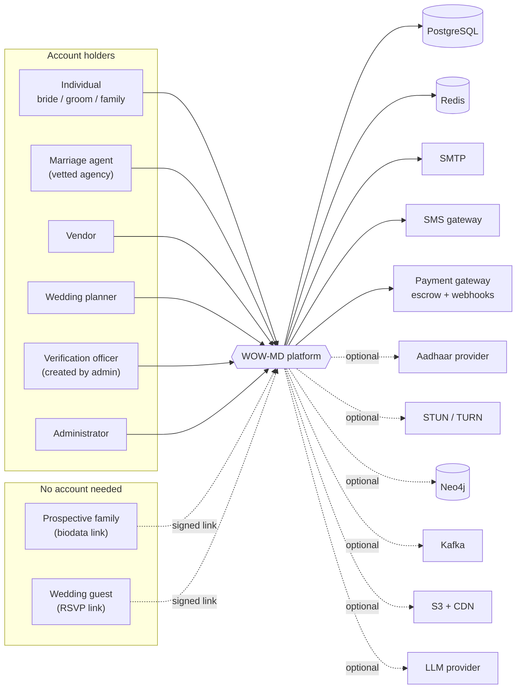
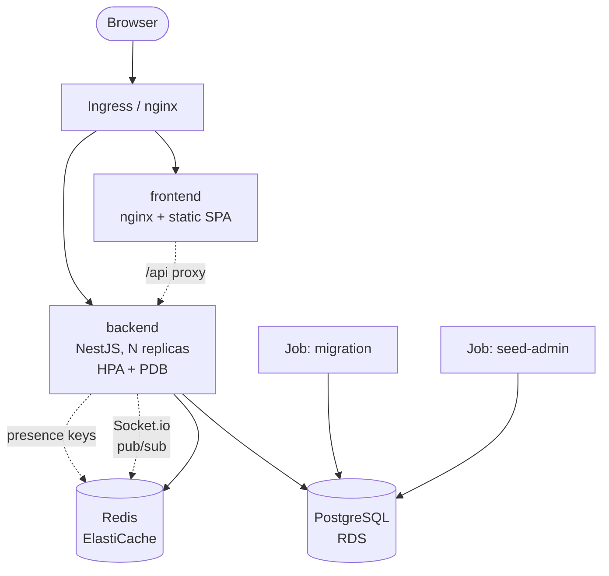

# High-level design

**WOW-MD** — a matrimony and wedding-services platform.

This document answers *what the system is and why it is shaped this way*. It is
the first of three altitudes:

| Altitude | Document | Answers |
| --- | --- | --- |
| **High** | this document | What the system is, who it serves, why it is built this way |
| **System** | [SLD.md](SLD.md) | How the subsystems divide the work and talk to each other |
| **Low** | [LLD.md](LLD.md) | The tables, routes, algorithms and configuration |

| | | | |
|---|---|---|---|
| **8** roles | **51** permissions | **30** modules | **43** tables |
| **225** routes | **13** migrations | **755** checks | **40k** lines TS |

---

## 1. The domain, and the assumption it overturns

Most matrimony software assumes the person seeking a match signs up, fills in a
form and searches. In the Indian market that is frequently not what happens. A
family visits a marriage agent's office, hands over a printed biodata and a
phone number, and the agent takes it from there — writing the profile up,
passing it to other agents, sending it to prospective families, and brokering
the introduction.

Two consequences run through the entire design:

1. **A profile is not an account.** The profile exists and is matchable long
   before — often instead of — anyone logging in.
2. **Circulation is a first-class operation**, with the consent machinery that
   responsibly passing someone else's details around demands.

A third consequence took longer to admit and is now equally load-bearing:

3. **The phone number is the identity, not the email address.** A walk-in
   family gives a mobile number and frequently no email at all. Every channel,
   every duplicate check and every invitation has to work from that number
   alone, or the platform cannot reach the people it has just taken on.

Around that core sits the rest of the wedding journey: a vendor and planner
marketplace with escrow, an auto-generated wedding timeline, multi-ceremony
guest management, honeymoon itineraries, and shareable photo albums.

### 1.1 Where the money is

Two revenue events, and the design treats them very differently.

- **The agency fee** — charged when a match is *fixed*, not when effort is
  spent. Held in escrow until the outcome it was charged for has happened.
- **Marketplace commission** — a percentage of each vendor or planner booking,
  computed at payment time and stored on the payment row so it cannot drift if
  the rate later changes.

Both flow through the same escrow model. Nothing is released on a promise.

---

## 2. System context

Five kinds of human hold accounts, plus two who never get one — the wedding
guest, and the family whose biodata is being circulated. Both are addressed by
signed single-purpose links rather than credentials.

Every external dependency has a local stand-in selected by an environment
variable, so the whole system runs end to end on a laptop with no credentials
of any kind. Dotted dependencies additionally degrade to no-ops when disabled.

---

## 3. Personas and the five invariants

| Account type | Role(s) | Purpose | Vetted? | Permissions |
| --- | --- | --- | --- | --- |
| Individual | `bride`, `groom` | Own profile, matchmaking, buying wedding services. | no | 23 |
| Individual | `family` | The same, and may steward a relative's profile. | no | 27 |
| Marriage agent | `agent` | Takes walk-in details, builds and circulates profiles, proposes matches, collects the agency fee. | field verification | 23 |
| Vendor | `vendor` | Sells wedding services; confirms and delivers bookings; paid from escrow. | field verification | 10 |
| Wedding planner | `planner` | Sells planning packages; co-manages the plans they are engaged on. | field verification | 14 |
| *not self-registerable* | `in_person` | Visits applicants, decides verifications, investigates disputes. | created by admin | 9 |
| *not self-registerable* | `admin` | Approvals, analytics, disputes, suspensions, audit. | seeded out of band | 51 |

The `in_person` row is deliberately the narrowest on the platform: an officer
decides whether other people get operational access, so they get the
verification and case queues and nothing else — and cannot allocate work to
themselves, because an officer choosing their own visits is not an allocation.

Five invariants hold across every request, enforced server-side:

1. **Only individuals buy.** The wedding marketplace belongs to the couple. An
   agency introduces two families and is paid for that introduction; it does
   not hire their photographer and does not hold their escrow. Vendors and
   planners sell and never buy.
2. **Only individuals take part in matchmaking.** An agent participates
   strictly under the identity of a client profile they manage.
3. **Nobody creates an account for someone else.** An agent builds the
   *profile*; the person themselves sets the password when they accept an
   invitation or a claim request.
4. **Nothing leaves the agency without consent.** Holding a family's details
   and circulating them are separate permissions, recorded separately, and
   circulation consent carries an expiry.
5. **Money moves only on a recorded outcome.** Escrow is released by work
   being delivered or by a settlement decision, never by a schedule and never
   by one party asserting it.

---

## 4. Architecture style: a modulith, deliberately

The backend is a single NestJS application with hard internal module
boundaries — a modulith, not microservices. For a platform at this stage that is
the right trade: one deployment, one database, atomic transactions across
booking and payment, and no distributed-transaction problem to solve before
there is traffic to justify it.

The boundaries are real, though. Each module owns its entities and exposes a
service; cross-module reads go through that service or through an explicitly
imported repository, never through a shared "models" dumping ground. A
transactional outbox (`outbox_events`) already decouples domain events from
their consumers, so extracting a module later means changing a consumer's
transport, not unpicking its data.

| Layer | Contains |
| --- | --- |
| **Edge** | nginx — serves the SPA, proxies `/api` and the Socket.io upgrade |
| **HTTP** | Controllers, DTOs, global `ValidationPipe` (whitelist + forbid unknown), four chained guards |
| **Domain** | 20 feature modules — services own the business rules and every ownership check |
| **Platform** | 11 shared modules — audit, mail, SMS, jobs, throttling, Redis, outbox, Neo4j, Kafka, health, websocket adapter |
| **Persistence** | TypeORM entities, hand-authored migrations, `synchronize: false` always |

Guards and validation sit above the domain so a service is never the first line
of defence, only the last.

### 4.1 What this costs

Worth stating plainly, because the trade is real:

- One deployment means one blast radius. A bad release takes everything down,
  not one subsystem.
- One database means one scaling ceiling. The matchmaking read load and the
  booking write load share it.
- Module boundaries are enforced by review and by import discipline, not by the
  network. They can be violated by anyone in a hurry.

The mitigation for the last one is that every violation is visible in an import
statement, and the outbox already exists for the cases that would otherwise
tempt a direct cross-module write.

---

## 5. Deployment topology

Two images. The backend is a multi-stage Node build that runs migrations then
boots; the frontend is a Vite build served by nginx. Local development is one
`docker compose up`; production is Kustomize-managed Kubernetes on
Terraform-provisioned AWS.

Redis is load-bearing four times over: cache, rate-limit counters, the
Socket.io adapter that makes chat work across replicas, and the presence keys
that decide whether somebody can be called.

**Statelessness.** Every backend replica is interchangeable. Sessions live in
Postgres, rate-limit counters and presence in Redis, and nothing of consequence
is held in process memory — which is what makes the HPA safe and a rolling
deploy uneventful.

**Scheduled work runs on every replica.** There is no leader election. Each of
the five jobs is written to be idempotent instead, because coordinating them
would be more machinery than the work is worth. See
[SLD §7](SLD.md#7-scheduled-work).

---

## 6. Technology choices

| Concern | Choice | Rationale |
| --- | --- | --- |
| API | NestJS 10 + TypeScript | DI and guard composition are what make a 51-permission matrix enforceable in one place rather than fifty-one. |
| Data | PostgreSQL 16 + TypeORM | Relational integrity matters here — escrow, consent and shares all need real foreign keys. Migrations are hand-authored; `synchronize` is never on. |
| Cache / coordination | Redis 7 + ioredis | Read-through caching, shared rate-limit counters, webhook replay keys, Socket.io fan-out, call presence. |
| Realtime | Socket.io + Redis adapter | Chat and call signalling must survive multiple replicas; the adapter routes to whichever pod holds the recipient. |
| Calling | WebRTC, signalling only | Media goes browser to browser. A relay carrying every call's audio is a bandwidth bill that scales with usage rather than with revenue. |
| Auth | JWT + Passport, TOTP | Short access token in memory, refresh token in an httpOnly cookie, per-device sessions in the database, single-use recovery codes. |
| Frontend | React 18, Vite, Tailwind | 37 pages, permission-gated routing, TanStack Query for server state. |
| Infrastructure | Docker, Kustomize, Terraform | VPC, EKS, RDS, ElastiCache as code; HPA and PodDisruptionBudget in the manifests. |
| Optional | Neo4j, Kafka, S3, LLM, Aadhaar, TURN | All behind flags or provider selectors. Off by default, and every method degrades to a safe no-op. |

---

## 7. Quality attributes, and how each is achieved

| Attribute | How | Where it is verified |
| --- | --- | --- |
| **Security** | Capability-based authorization on every route; two-layer checks; hashed credentials, tokens, OTPs and government IDs; append-only audit. | `verify-rbac.sh` (147), unit tests on the matrix and guards |
| **Privacy** | Consent recorded per scope with expiry; profile projection strips exact dates and gates photos; contact details redacted before storage; export and erasure. | `verify-circulation.sh` (78), `verify-phase3.sh` (61) |
| **Correctness of money** | Escrow with milestones, alternating with work; commission fixed at payment time; settlement recorded on both case and payment. | `verify-phase1.sh` (151), unit tests on the split |
| **Consistency** | Row locks inside the transaction that needs them; idempotency keys on payment; unique partial indexes on the invariants. | `verify-phase2.sh` (108) |
| **Availability** | Stateless replicas, HPA, PDB, health probes, optional dependencies degrading to no-ops. | health endpoints, `docker-build` in CI |
| **Operability** | Structured logs, alertable audit events, five scheduled jobs, one config file with validation at boot. | CI, `verify-phase3.sh` |

---

## 8. Constraints and deliberate limits

**Regulatory.** Aadhaar verification is subject to UIDAI licensing. The
platform therefore never stores the number: it is checked, turned into an HMAC
under a server-side pepper, and discarded, leaving only the last four digits.
This is a design constraint that improved the design.

**Commercial.** Real escrow *payout* needs Razorpay Route with linked accounts
and per-vendor KYC. Until that exists the split is computed and recorded
correctly, and release is a logged no-op. This is the largest gap between the
system as designed and the system as deployable.

**Physical.** Roughly one network in ten cannot traverse NAT peer-to-peer, so a
fraction of calls need a TURN relay — which costs money precisely because it
carries the audio. The ICE configuration is environment-driven so enabling it
is a deployment change.

**Market.** SMS in India requires DLT-registered templates per message type.
The SMS provider interface takes a template id for exactly this reason.

---

## 9. Principal risks

| Risk | Consequence | Mitigation |
| --- | --- | --- |
| An agency floods the shared network pool | The pool stops being useful to everyone else | Per-agency quota; automatic de-listing as consent lapses |
| Consent expires unnoticed while a profile is circulating | A family's details stay in circulation without permission | Expiry on circulation consent; nightly de-listing a week ahead of lapse |
| A gateway and our records diverge | Money held or refunded in one system and not the other | Hourly reconciliation raising a mismatch for a human, deliberately not auto-correcting |
| An officer approves without visiting | Field verification becomes a rubber stamp | Admin cannot approve at all; only an allocated officer decides, and every decision is recorded with its reason |
| Two buyers race for the last slot | A vendor double-booked on a wedding day | Pessimistic row lock inside the booking transaction |
| The client's permission mirror drifts from the server's | Navigation hides or offers the wrong things | A frontend test reads the backend enum off disk and fails on drift |

---

## 10. Companion documents

- [SLD.md](SLD.md) — subsystems, their contracts, and the end-to-end flows.
- [LLD.md](LLD.md) — data model, permission matrix, API surface, algorithms.
- [RBAC-AND-ROLES.md](RBAC-AND-ROLES.md) — the authorization contract in full.
- [PROFILES-AND-INVITATIONS.md](PROFILES-AND-INVITATIONS.md) — profiles without
  accounts, stewardship, invitation and claim.
- [CIRCULATION.md](CIRCULATION.md) — intake, the two consent scopes, and the
  five ways a biodata reaches another family.
- [ISSUE-REGISTER.md](ISSUE-REGISTER.md) — the specification, item by item.
- [SELF-REVIEW.md](SELF-REVIEW.md) — what was wrong, what was fixed, what is
  deliberately still open.
- [DOCKER-AND-TESTING.md](DOCKER-AND-TESTING.md) — how to run all of it.
