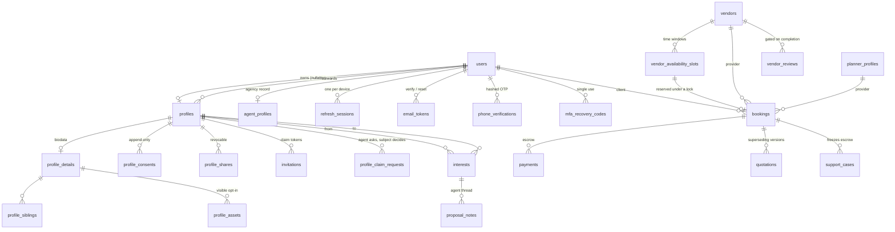

# Low-level design

Tables, routes, algorithms, configuration. The altitudes above are
[HLD.md](HLD.md) and [SLD.md](SLD.md).

---

## Contents

- [1. Data model](#1-data-model)
- [2. Permission matrix](#2-permission-matrix)
- [3. API surface](#3-api-surface)
- [4. Request lifecycle](#4-request-lifecycle)
- [5. Token and credential design](#5-token-and-credential-design)
- [6. Key algorithms](#6-key-algorithms)
- [7. Configuration](#7-configuration)
- [8. Migrations](#8-migrations)
- [9. Error handling](#9-error-handling)
- [10. Operations](#10-operations)
- [11. Verification inventory](#11-verification-inventory)

---

## 1. Data model

49 application tables across 49 entities, plus TypeORM's own `migrations`
ledger. The core cluster is shown below; the marketplace, catalog, planning and
media clusters hang off `users` in the same way.



Note the two distinct `users → profiles` edges: ownership and stewardship.

| Cluster | Tables | Notes |
| --- | --- | --- |
| Identity | `users`, `profiles`, `refresh_sessions`, `email_tokens`, `phone_verifications`, `mfa_recovery_codes` | `profiles.userId` nullable with a partial unique index; sessions carry a `familyId` for reuse detection. Phone codes are SHA-256 and attempt-limited; recovery codes are bcrypt, because they are as good as a password |
| Biodata | `profile_details`, `profile_siblings`, `profile_assets`, `identity_otp_sessions` | One row per profile, saved a section at a time. Filterable answers sit in indexed columns; the rest is grouped jsonb. Assets are private unless individually marked visible. An Aadhaar number is never stored — only an HMAC under a pepper and the last four digits |
| Stewardship | `agent_profiles`, `agent_charges`, `invitations`, `profile_claim_requests` | Agency approval gate; hashed single-use claim tokens. `invitations.email` is nullable, so an invitation can go out by SMS alone. One live claim request per profile, enforced by a partial unique index |
| Circulation | `profile_consents`, `profile_shares`, `proposal_notes` | Append-only consent; shares carry view counts and a revoke timestamp |
| Matchmaking | `interests`, `conversations`, `messages` | Interests are profile-keyed; chat is account-keyed. Messages carry `redactedCount` so repeated attempts to pass a number across are visible without storing the number |
| Marketplace | `vendors`, `planner_profiles`, `vendor_reviews`, `vendor_availability_slots`, `bookings`, `payments`, `quotations`, `disputes` | Payments hold the commission split and an idempotency key. A slot is a time window on a date carrying `capacity`, `confirmed` and `pending`; only `confirmed` is measured against capacity, and it moves when the vendor accepts the job |
| Catalog | `service_categories`, `service_definitions`, `service_attributes`, `vendor_services`, `service_offerings` | Configuration rather than code: a new trade is rows an administrator writes. Answers live in validated jsonb, so an administrator adds a question without a migration and the validator stops that becoming a free-for-all |
| Verification | `verification_requests`, `officer_service_areas`, `support_cases` | A request carries the officer's findings and what the allocation went on. Coverage is rows rather than a region string, so a near-miss on a place name cannot read as no coverage. Both requests and cases carry an append-only `history`. A case records which instalment it disputes, its evidence, whether it needs a physical visit, and the booking status to restore on settlement |
| Planning | `wedding_plans`, `plan_tasks`, `events`, `guests`, `event_invites` | Invites carry a hashed RSVP token for guests with no account, plus two head counts — how many were invited and how many are actually coming, which is what the caterer is ordered from |
| Content | `albums`, `media_items`, `destinations`, `travel_packages`, `itineraries` | Albums support a public share token |
| Platform | `audit_events`, `outbox_events`, `notifications` | Audit is append-only by design — no update or delete path exists |

### 1.1 Indexes that carry a rule

Not every index is about speed. These encode an invariant:

| Index | Table | Enforces |
| --- | --- | --- |
| partial unique on `userId` where not null | `profiles` | One profile per account, while allowing many accountless profiles |
| unique on `governmentIdHash` | `profiles` | One government document, one profile — platform-wide |
| unique on `idempotencyKey` where not null | `payments` | A retried payment returns the original rather than holding twice |
| partial unique on `profileId` where `status = 'pending'` | `profile_claim_requests` | One live request per profile; an agent tapping twice does not produce two decisions |
| unique on `tokenHash` | `invitations`, `email_tokens` | A token addresses exactly one row |
| composite on `(subjectType, subjectId)` | `support_cases` | Finding every case against one booking |
| unique on `(vendorId, definitionId)` | `vendor_services` | One business offers a given service once. Two rows is a duplicate listing, not two products — the products are the offerings underneath |
| unique on `(definitionId, scope, key)` | `service_attributes` | The same word can be asked of the vendor and of the buyer without one overwriting the other |
| check: price present unless quote-only | `service_offerings` | A priced offering with a null price is unrenderable, and the database is the one place that cannot be bypassed |
| check: `confirmed <= capacity` | `vendor_availability_slots` | Six bookings in a window built for five is the one failure a wedding vendor cannot recover from |

---

## 2. Permission matrix

52 permissions across 8 roles. Admin is computed as `Object.values(Permission)`,
so a new capability is never accidentally withheld from support staff.

| Role | Permissions held |
| --- | --: |
| `bride`, `groom` | 23 |
| `family` | 27 |
| `agent` | 23 |
| `planner` | 14 |
| `vendor` | 10 |
| `in_person` | 9 |
| `admin` | 52 |

B/G = bride and groom, F = family, O = in-person officer.

| Capability | B/G | F | Agent | Vendor | Planner | O | Admin |
| --- | :-: | :-: | :-: | :-: | :-: | :-: | :-: |
| `profile:manage:own` | ● | ● | ● | ● | ● | ● | ● |
| `match:browse` / `send_interest` | ● | ● | ● | · | · | · | ● |
| `match:respond_interest` | ● | ● | ● | · | · | · | ● |
| `match:lifecycle` / `match:fix` | ● | ● | ● | · | · | · | ● |
| `chat:match` | ● | ● | · | · | · | · | ● |
| `chat:inquire` | ● | ● | ● | ● | ● | ● | ● |
| `managed_profile:manage` / `invite` | · | ● | ● | · | · | · | ● |
| `act_on_behalf` | · | ● | ● | · | · | · | ● |
| `profile:circulate` | · | ● | ● | · | · | · | ● |
| `network_pool:browse` | · | · | ● | · | · | · | ● |
| `agency:manage` | · | · | ● | · | · | · | ● |
| `agency_fee:pay` | ● | ● | ● | · | · | · | ● |
| `client:create` / `read` / `act_on_behalf` | · | · | ● | · | · | · | ● |
| `booking:create` / `pay` / `read:own` | ● | ● | · | · | · | · | ● |
| `booking:confirm` / `complete` / `read:incoming` | · | · | · | ● | ● | · | ● |
| `vendor_listing:manage` | · | · | · | ● | · | · | ● |
| `planner_listing:manage` | · | · | · | · | ● | · | ● |
| `review:write` | ● | ● | · | · | · | · | ● |
| `plan:manage:own` | ● | ● | · | · | · | · | ● |
| `plan:manage:engaged` | · | · | · | · | ● | · | ● |
| `event:manage:own` | ● | ● | · | · | ● | · | ● |
| `media:manage:own` | ● | ● | ● | · | ● | · | ● |
| `travel:book` | ● | ● | · | · | · | · | ● |
| `ai:assist` | ● | ● | ● | · | ● | · | ● |
| `session:manage:own` / `mfa:manage:own` | ● | ● | ● | ● | ● | ● | ● |
| `dispute:raise` | ● | ● | ● | ● | ● | · | ● |
| `case:raise` | ● | ● | ● | ● | ● | ● | ● |
| `verification:process` / `decide` | · | · | · | · | · | ● | ● |
| `verification:allocate` | · | · | · | · | · | · | ● |
| `case:investigate` / `settle` | · | · | · | · | · | ● | ● |
| `case:allocate` | · | · | · | · | · | · | ● |
| `catalog:manage` | · | · | · | · | · | · | ● |
| `admin:*` (6 capabilities) | · | · | · | · | · | · | ● |

Three rows are worth reading twice:

- **`booking:create` is absent from the agent row.** The wedding marketplace
  belongs to the couple; an agency is paid for the introduction. `agency_fee:pay`
  exists so fee collection does not have to borrow `booking:pay`.
- **`media:manage:own` and `ai:assist` are absent from the vendor row.** Wedding
  albums and the planning assistant belong to the couple, not the caterer they
  hired. A vendor's portfolio lives on the listing.
- **`verification:allocate` and `case:allocate` are admin-only.** An officer who
  could allocate to themselves would be choosing their own visits.

---

## 3. API surface

261 routes over 26 controllers, prefixed `/api` and documented at `/api/docs`
via Swagger. 24 are public; everything else requires a bearer token and clears
the guard chain in [§4](#4-request-lifecycle).

| Prefix | Routes | Public | Covers |
| --- | --: | --: | --- |
| `/agents` | 25 | 0 | Agency record and status, managed profiles, photos, invitations, claim requests, client book, billing |
| `/auth` | 24 | 10 | Register, login, refresh, logout, sessions, MFA and recovery codes, phone verification, email verification, password recovery, invitation preview and accept |
| `/verification` | 22 | 0 | Officers, verification requests, workload, allocation, decisions; support cases, evidence, escalation, settlement |
| `/circulation` | 20 | 1 | Consent record/state/history/revoke, five share paths, pool search, agent directory, proposal threads, reach, public biodata |
| `/vendors` | 16 | 4 | Listings, availability slots and calendar, public search and detail, gated review |
| `/bookings` | 15 | 0 | Create, list, incoming, quotations, milestones, pay, confirm, start, complete, settle, cancel, earnings |
| `/profiles/:id` | 14 | 0 | The biodata, section by section; siblings, assets, primary photo, completion |
| `/matches` | 13 | 0 | Suggestions with filters, interest send/accept/reject, incoming, outgoing, accepted, block, report, Match Fixed, status |
| `/admin` | 13 | 0 | Agency/planner approvals, user suspension, analytics, disputes, audit trail |
| `/events` | 12 | 2 | Ceremonies, per-event vendors, guests, invitations, host RSVP override, public guest RSVP |
| `/planner` | 7 | 0 | Plan, auto timeline, tasks, planner engagement |
| `/media` | 7 | 1 | Albums, items, presigned upload, profile-photo presign, public shared album |
| `/users` | 6 | 0 | Own profile, government ID, data export and erasure |
| `/travel` | 5 | 3 | Destinations, package search, itineraries |
| `/chat` | 5 | 0 | Messages, history, conversations, read receipts, presence |
| `/wedding-planners` | 4 | 2 | Public search and detail, own listing get/upsert |
| `/notifications` | 4 | 0 | Inbox, unread count, mark read, mark all read |
| `/ai` | 4 | 0 | Match and vendor recommendations, budget insight, assistant |
| `/profiles/:id/identity/aadhaar` | 3 | 0 | Send OTP, verify OTP, state |
| `/profile-claims` | 3 | 0 | The subject's side: list, approve, decline |
| `/payments` | 1 | 1 | Signed gateway webhook |

### 3.1 The public routes, and what protects each

| Route | Protection |
| --- | --- |
| `POST /auth/register`, `/auth/login` | Throttled by `AUTH_RATE_LIMIT_MAX` per window per IP; account lockout after repeated failures |
| `POST /auth/refresh` | The refresh token itself is the credential; rotated, with reuse detection |
| `POST /auth/password/forgot`, `/reset` | Throttled 5 per 5 min; identical response whether or not the address exists |
| `GET`/`POST /auth/invitations/*` | Hashed single-use token, expiring |
| `GET`/`PUT /events/rsvp/:token` | Hashed token addressing exactly one invite |
| `GET /circulation/biodata/:token` | Hashed token, expiring, revocable, consent re-checked on read |
| `GET /media/shared/:token` | Album share token |
| `POST /payments/webhook` | HMAC over the raw body plus Redis replay protection |
| `GET /vendors/search`, `/wedding-planners/search`, `/vendors/:id/availability` | Approved listings only; pagination bounded by config |
| `GET /travel/destinations`, `/travel/packages` | Catalogue data, no personal information |

### 3.2 Realtime events

Socket.io, namespace `/chat`, authenticated on the handshake by JWT.

| Event | Direction | Carries |
| --- | --- | --- |
| `message:send` / `message:new` | both | A chat message, contact details already redacted |
| `presence:heartbeat` / `presence:changed` | both | Keeps the Redis presence key alive; announces a change |
| `call:offer` / `call:incoming` | both | SDP offer plus the ICE configuration |
| `call:answer` / `call:answered` | both | SDP answer |
| `call:candidate` | both | One ICE candidate |
| `call:end` / `call:ended` | both | Hang up, decline, or give up on a connection that will not form |

---

## 4. Request lifecycle

Four guards run globally, in a fixed order. The subtlety worth knowing:
`@Public()` beats a class-level `@RequirePermissions` in both the auth guard and
the permissions guard — that is what lets a signed-token route such as the guest
RSVP live on an otherwise-guarded controller.

```text
Request
  │
  ├─ 1  AccountThrottlerGuard   Redis counter, keyed user:<id> when signed in, else ip:<addr>
  │
  ├─ 2  JwtAuthGuard            verifies the access token; @Public() short-circuits
  │        └─ JwtStrategy       re-reads role + isActive FROM THE DATABASE,
  │                             so a suspension takes effect immediately
  │
  ├─ 3  PasswordResetGuard      an account holding an emailed temporary password
  │                             can reach exactly one route until it replaces it
  │
  ├─ 4  PermissionsGuard        @RequirePermissions — ALL listed capabilities required
  │
  ├─ 5  ValidationPipe          whitelist + forbidNonWhitelisted + transform
  │                             (rejects unknown fields rather than stripping them)
  │
  ├─ 6  Controller              thin — resolves the actor, delegates
  │
  ├─ 7  Service                 business rules + OWNERSHIP CHECK  ← the second layer
  │
  └─ 8  AllExceptionsFilter     uniform error shape, no stack traces to the client
```

Steps 4 and 7 are the two authorization layers from
[SLD §3](SLD.md#3-authorization-two-layers-that-answer-different-questions).

`RolesGuard`, a coarser role check from the first iteration, was removed once
the permission guard had replaced it everywhere — a second authorization
mechanism nobody used is a trap for the next person.

---

## 5. Token and credential design

Five opaque token families, all built the same way: 32 bytes of CSPRNG output,
base64url, returned exactly once, with only the SHA-256 persisted. A database
leak therefore yields no working links. SHA-256 rather than bcrypt is
deliberate — these are high-entropy random values, not user-chosen secrets, so
there is nothing to brute-force and lookup stays a single indexed query.

| Token | Stored as | Default life | Single use | Revocable |
| --- | --- | --- | :-: | :-: |
| Access JWT | not stored | 15 min | · | via `tokenVersion` |
| Refresh JWT | SHA-256 in `refresh_sessions` | 30 days | ✓ rotated | ✓ |
| Profile invitation | SHA-256 in `invitations` | 7 days | ✓ | ✓ |
| Email verification | SHA-256 in `email_tokens` | 48 hours | ✓ | · |
| Password reset | SHA-256 in `email_tokens` | 30 min | ✓ | · |
| Guest RSVP | SHA-256 in `event_invites` | 120 days | · reusable | ✓ |
| Biodata share | SHA-256 in `profile_shares` | 30 days | · reusable | ✓ |

Three credentials are **not** tokens and are hashed accordingly:

| Credential | Hash | Why |
| --- | --- | --- |
| Password | bcrypt | User-chosen, low entropy, must be slow to attack |
| MFA recovery code | bcrypt | As good as a password, and short enough that a fast hash is brute-forceable offline |
| Phone OTP | SHA-256 + attempt limit | Six digits is a million combinations — nothing to a script, but three guesses is |
| Aadhaar number | HMAC under a server-side pepper | A plain hash of a 12-digit number is reversible in minutes. The number itself is never stored |

**Refresh rotation and reuse detection.** Every refresh issues a new token and
marks the old row replaced. Presenting an already-replaced token means it
leaked, so the entire *family* — that login and all its rotations — is revoked
rather than just that row, and the event is audited. Both JWTs carry a random
`jti`: without it, two logins in the same second produce byte-identical tokens.

**Password change ends live sessions.** A `tokenVersion` counter is minted into
every access token and compared on each request. An earlier attempt compared the
token's issue time against `passwordChangedAt` and flaked once under a clock
that moved backwards — two clocks only have to disagree once.

---

## 6. Key algorithms

### 6.1 Compatibility scoring

A pure, side-effect-free function over two profiles, normalised to 0–100. Every
weight comes from environment configuration, so the product team can re-tune
matching without a code change.

| Factor | Default weight | Rule |
| --- | --: | --- |
| Age proximity | 20 | Linear from full score at zero gap to nil at `MATCH_MAX_AGE_GAP` (8 years) |
| Location | 20 | Exact city match, case-insensitive |
| Religion | 20 | Exact match |
| Education | 15 | Exact match |
| Lifestyle | 15 | Jaccard overlap of the two tag sets |
| Stated preference | 10 | Candidate falls inside the viewer's preferred age window |

Anything below `MATCH_MIN_SCORE` (40) is withheld. Same city plus a two-year age
gap alone scores 35 — deliberately not enough.

**Recommendations** apply a floor of 50 and return fewer rows rather than
padding. A list topped up with twelve-percent matches to reach five teaches
people to ignore it.

### 6.2 Consent evaluation

`stateFor(profileId)` reduces the append-only history to a decision. The useful
nuance is distinguishing *never asked* from *asked, but lapsed* — the second is
a prompt to ring the family back, not to start a fresh conversation.

```text
rows        ← all consent records for the profile
live(scope) ← newest row where: scope matches
                                AND revokedAt is null
                                AND (expiresAt is null OR expiresAt > now)

intake         = live(INTAKE)
circulation    = live(CIRCULATION)
mayCirculate   = intake AND circulation
needsReconfirm = NOT circulation AND (any CIRCULATION row ever existed)

assertMayCirculate(profile):
  if profile.claimStatus in (SELF, CLAIMED): return   ← own details, no agency record needed
  if not mayCirculate: throw Forbidden(reason)
```

### 6.3 Commission split

Computed in minor units to avoid float drift, and floored so the two parts
always sum back to exactly the amount held in escrow. Rounding favours the
provider.

```text
gross      = round(amount × 100)                 // paise
commission = floor(gross × PAYMENT_COMMISSION_PERCENT / 100)
payout     = gross − commission                  // invariant: commission + payout = gross
```

### 6.4 Milestone amounts

Three instalments — 30 / 30 / 40 by default. The final one is the **remainder**
rather than its own percentage, so rounding can never leave a rupee uncollected
or collect one too many: advance + second + final equals the total exactly. The
three percentages must sum to 100 or the application refuses to boot.

Which instalment is payable is decided by the booking's own state, not by what
has been paid so far:

| Milestone | Payable when |
| --- | --- |
| Advance | `PAYMENT_PENDING` |
| Second | `IN_PROGRESS` — the provider has started |
| Balance | `COMPLETED_PENDING_FINAL_PAYMENT` — the provider says it is done |

### 6.5 Profile projection

Two deliberately different views of the same record. What separates them is not
the data but how the viewer got there.

| Field | `PublicProfileView` (match suggestions) | `BiodataView` (deliberate share) |
| --- | --- | --- |
| Date of birth | Five-year age band only | Exact date |
| Photos | One lead photo if public; none if matches-only, until matched | Full set |
| Bio | After a match | Always |
| Income | Never | Only if explicitly marked visible |
| Family assets | Never | Only those individually marked visible |
| Search preferences | Never — describes what they want, not who they are | Never |
| Contact details | Never | Never — the agent brokers the introduction |

### 6.6 Availability, and why the window is computed

A vendor's calendar is a rolling six months from today, worked out per
request and never stored. The alternative — rows for a fixed window — needs
somebody or something to open the next quarter, and the failure mode is a vendor
who silently cannot be booked from the first of the month. Computing it means
there is nothing to forget.

Within that window, availability is time slots rather than days. A photographer
sells a morning and an evening on the same Saturday; a hall sells three
sittings. Each slot carries its own capacity and its own status, and the two are
deliberately separate: one confirmed booking takes a slot even when its capacity
is twenty, because capacity describes how many people fit, not how many jobs the
vendor can run at once.

Reservation happens inside the transaction that creates the booking, under a
`pessimistic_write` lock on the slot row:

```text
BEGIN
  SELECT * FROM vendor_availability_slots WHERE id = :slot FOR UPDATE
  assert status = AVAILABLE AND booked < capacity
  assert no active request from this buyer for this slot      ← duplicate refusal
  INSERT booking
  UPDATE slot SET booked = booked + 1, status = PENDING
COMMIT
```

Checking availability and then writing would leave a window in which a second
buyer reads the same answer; the lock closes it, so two buyers racing for the
last Saturday afternoon serialise and the second is refused with the id of the
booking that won.

### 6.7 Completeness, asked twice

`profiles.profileCompleted` gates matchmaking and asks only for the basics — a
name, a gender, a date of birth, a city. `isBiodataComplete()` gates circulation
and asks for every biodata section except identity. Both are computed from what
is stored rather than tracked as flags, so neither can drift from the truth.

A defect worth recording: `horoscopeAvailable` defaulted to `false`, so a
profile with only its name filled in already counted as having *answered* the
horoscope question. The column is nullable now — false means somebody said no.

### 6.8 Verhoeff, for Aadhaar

An Aadhaar number carries a Verhoeff check digit over all twelve digits, and the
first digit is never 0 or 1. Validation runs the standard dihedral-group
tables; a number that fails is refused before anything is hashed or sent.

---

## 7. Configuration

Every tunable is an environment variable, read in one place and validated at
boot by a Joi schema — the app fails fast on a malformed value rather than
misbehaving later. Application code reads through a typed `AppConfigService`,
never `process.env`.

| Group | Notable keys |
| --- | --- |
| Runtime | `NODE_ENV`, `PORT`, `API_PREFIX`, `CORS_ORIGINS`, `LOG_LEVEL`, `SWAGGER_ENABLED` |
| Auth | `JWT_SECRET`, `JWT_EXPIRES_IN`, `JWT_REFRESH_SECRET`, `BCRYPT_ROUNDS`, `REFRESH_COOKIE_NAME`, `COOKIE_SECURE`, `COOKIE_SAME_SITE` |
| Account safety | `MAX_FAILED_LOGINS`, `LOCKOUT_MINUTES`, `MFA_REQUIRED_FOR_ADMIN`, `MFA_ISSUER` |
| Token lifetimes | `INVITATION_TTL_HOURS`, `EMAIL_VERIFY_TTL_HOURS`, `PASSWORD_RESET_TTL_MINUTES`, `RSVP_TOKEN_TTL_DAYS`, `SHARE_LINK_TTL_DAYS` |
| Stewardship | `REQUIRE_AGENT_APPROVAL`, `MAX_MANAGED_PROFILES`, `MAX_MANAGED_PROFILES_FAMILY`, `MAX_INVITATION_RESENDS`, `CIRCULATION_CONSENT_VALIDITY_DAYS`, `POOL_QUOTA_PER_AGENCY` |
| Matchmaking | `MATCH_WEIGHT_*` (6), `MATCH_MAX_AGE_GAP`, `MATCH_MIN_SCORE`, `MATCH_SUGGESTIONS_CACHE_TTL` |
| Payments | `PAYMENT_PROVIDER`, `PAYMENT_COMMISSION_PERCENT`, `PAYMENT_MILESTONE_*`, `PAYMENT_WEBHOOK_SECRET`, `RAZORPAY_*` |
| Mail | `MAIL_PROVIDER`, `MAIL_FROM`, `SMTP_*`, `APP_BASE_URL` |
| SMS | `SMS_PROVIDER`, `SMS_URL`, `SMS_API_KEY`, `SMS_SENDER_ID`, `SMS_TEMPLATE_ID`, `PHONE_VERIFY_TTL_MINUTES` |
| Identity | `AADHAAR_PROVIDER`, `GOVERNMENT_ID_PEPPER` |
| Calling | `STUN_URLS`, `TURN_URL`, `TURN_STATIC_AUTH_SECRET` (preferred), `TURN_REALM`, `TURN_CREDENTIAL_TTL_SECONDS`; `TURN_USERNAME` / `TURN_CREDENTIAL` for a relay that only does static auth |
| Limits | `RATE_LIMIT_TTL`, `RATE_LIMIT_MAX`, `AUTH_RATE_LIMIT_MAX`, `PAGINATION_DEFAULT_LIMIT`, `PAGINATION_MAX_LIMIT` |
| Optional | `NEO4J_ENABLED`, `KAFKA_ENABLED`, `MEDIA_STORAGE_PROVIDER`, `AI_PROVIDER` |

**A note on `AUTH_RATE_LIMIT_MAX`.** It is read at import time by the auth
controller rather than through `AppConfigService`, because a decorator is
evaluated when the file is imported, long before any provider exists. The Joi
schema still validates it at boot. A named throttler would have been tidier, but
every configured throttler in `@nestjs/throttler` applies to every route, which
would clamp the whole API to the auth ceiling.

---

## 8. Migrations

Thirteen hand-authored migrations, applied in timestamp order.
`synchronize` is never enabled — a schema that drifts from its migrations is a
schema nobody can reproduce.

| Timestamp | Brings in |
| --- | --- |
| `1710000000000` | Initial schema |
| `1710000001000` | Multi-persona RBAC |
| `1710000002000` | Agent-built profiles and invitations |
| `1710000003000` | Sessions, audit, MFA, webhooks |
| `1710000004000` | Consent and circulation |
| `1710000005000` | Field verification and settlement |
| `1710000006000` | Booking lifecycle and time-slot availability |
| `1710000007000` | Profile biodata and agency details |
| `1710000008000` | Profile postal address |
| `1710000009000` | Horoscope: unanswered ≠ answered no |
| `1710000010000` | Dispute milestone, evidence, escalation |
| `1710000011000` | SMS channel and phone verification |
| `1710000012000` | MFA recovery codes and profile claim requests |

Every one is additive and reversible. Two carry data migrations worth knowing
about: `1710000006000` carries day-level availability rows over to time slots,
and `1710000009000` sets `horoscopeAvailable` to NULL only where nothing was
ever entered.

---

## 9. Error handling

`AllExceptionsFilter` gives every failure the same shape, and never leaks a
stack trace to a client.

```json
{
  "statusCode": 409,
  "timestamp": "2026-08-21T18:00:00.000Z",
  "path": "/api/bookings",
  "error": {
    "message": "You have already asked this vendor for that window",
    "error": "Conflict",
    "statusCode": 409,
    "code": "DUPLICATE_BOOKING_REQUEST",
    "bookingId": "…"
  }
}
```

| Status | Means | Example |
| --- | --- | --- |
| 400 | The request is malformed, or the domain refuses it | An inverted age range; an incomplete biodata being circulated |
| 401 | No valid credential | An expired access token |
| 403 | A valid credential without the capability, or the record is not theirs | A vendor calling `/matches/suggestions` |
| 404 | Not found, or deliberately indistinguishable from it | An invitation token that never existed |
| 409 | A real conflict the caller can act on | A duplicate phone number at intake |
| 429 | Throttled | Repeated sign-in attempts |

Where a client can do something specific about a refusal, the error carries a
machine-readable `code` alongside the human sentence — `DUPLICATE_BOOKING_REQUEST`
hands back the existing booking id so the client can open it, and
`PASSWORD_RESET_REQUIRED` tells the client to route to the one screen the
account can reach.

---

## 10. Operations

### 10.1 Local stack

```bash
cp docker/.env.example docker/.env          # then set the secrets
docker compose -f docker/docker-compose.yml up -d --build
```

```bash
# admin cannot be self-registered — seed the first one out of band
docker compose -f docker/docker-compose.yml --profile seed run --rm seed-admin
```

Migrations run automatically on backend start. Every external provider defaults
to a local stand-in — `MAIL_PROVIDER=log` and `SMS_PROVIDER=log` print the
action link or code to the container log, `AADHAAR_PROVIDER=mock` returns a
development OTP — so every flow is exercisable without a single credential.

### 10.2 Two migrations that need an operator, not just a deploy

> [!WARNING]
> **`1710000003000` deletes rows.** Moving interests from user ids to profile
> ids drops any interest whose profile cannot be resolved. Check the count
> first on live data.
>
> **`1710000004000` back-fills intake consent but deliberately not circulation
> consent** — nobody agreed to that. Existing agency-built profiles therefore
> become un-circulatable until an agent re-asks the family. That is correct
> behaviour, and an operational step rather than a silent upgrade.

Everything else is additive and reversible.

### 10.3 Kubernetes and cloud

Eleven Kustomize manifests: namespace, config, secret template, deployment,
service, ingress, HPA, PodDisruptionBudget, and two one-shot Jobs — migration
(wire as a pre-upgrade hook so it runs exactly once) and admin seeding (once per
environment, then delete). Terraform provisions VPC, EKS, RDS and ElastiCache.

---

## 11. Verification inventory

Authorization is the kind of thing unit tests flatter and reality punishes, so
most of the assurance is live: six suites that run against the actual
containers and exit non-zero on any failure.

| Suite | Checks | Covers |
| --- | --: | --- |
| `jest` (backend unit) | 103 | Permission matrix, guards, booking authorization, commission split, auth flows, consent state machine, contact redaction, government-ID validation and hashing |
| `vitest` (frontend) | 7 | The client's permission mirror against the backend enum read off disk, capability checks, role labels |
| `app.e2e-spec.ts` | 27 | Functional integration against real Postgres and Redis, including the registration rules and each persona's scope |
| `verify-rbac.sh` | 147 | Privilege escalation, per-persona permissions, agency vetting, booking IDOR, escrow transitions, Match Fixed gating, review gating, event ownership, validation, cookie-borne refresh |
| `verify-invites.sh` | 73 | Agency approval, account-less profiles, invitation and claim, profile-completion gate, multi-device sessions, lockout, signed webhooks, audit, 2FA, pagination |
| `verify-circulation.sh` | 78 | Phone-first intake, duplicate detection, both consent scopes, the biodata-completeness gate, all five circulation paths, read-only enforcement, withdrawal, cross-agent threads |
| `verify-phase1.sh` | 151 | Officer accounts and the forced password reset, the verification queue and its separations, identity and duplicate refusal, agency fees, Match Fixed and provisioning, vendor compliance, quotations, escrow milestones, case-frozen escrow, chat redaction, the profile lifecycle |
| `verify-phase2.sh` | 108 | The sectioned biodata and its completion report, Aadhaar OTP and one-document-one-profile, notifications, the accounts ledger, the chat dashboard and presence, events with per-event vendors, honeymoon search, match filters, disputes with milestone and evidence |
| `verify-phase3.sh` | 61 | SMS delivery, phone verification, phone-only invitations, profile claim requests, recovery codes, data export and erasure, the pool quota, circulation reach, photo uploads |

**898 live assertions plus 181 automated tests.** Each shell suite clears its
own Redis rate-limit counters first, since those deliberately survive restarts,
and varies the data that carries a uniqueness constraint — phone numbers,
identity documents, GST, Aadhaar — so a second run does not collide with the
first.

```bash
docker run --rm --network docker_default -v "$PWD/scripts:/scripts" alpine:3.20 \
  sh -c "apk add --no-cache curl jq openssl redis >/dev/null && sh /scripts/verify-rbac.sh"
```

CI runs lint, both typechecks, the unit tests, migrations, the e2e suite, the
frontend build and both production images on every push.

---

## Companion documents

- [HLD.md](HLD.md) — what the system is and why.
- [SLD.md](SLD.md) — subsystems and their contracts.
- [RBAC-AND-ROLES.md](RBAC-AND-ROLES.md) — the authorization contract in full.
- [DOCKER-AND-TESTING.md](DOCKER-AND-TESTING.md) — running the stack and the suites.
