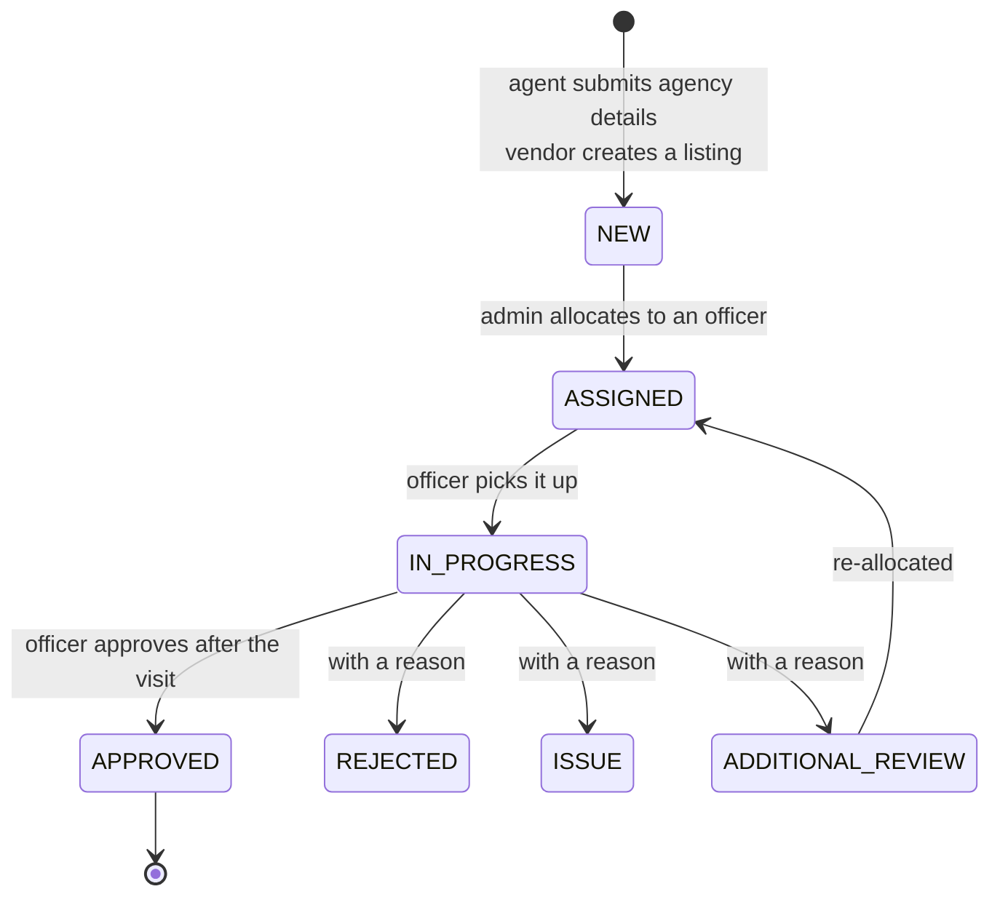
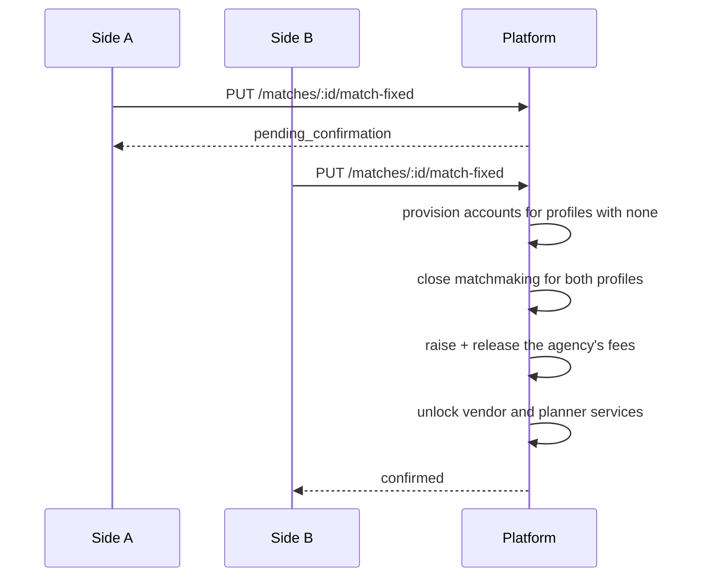

# Phase 1: verification, Match Fixed, and money that follows outcomes

What this round added, and why each piece is shaped the way it is. It implements
the Phase 1 specification on top of the existing platform; nothing here replaces
what came before, and every schema change is additive.

The through-line: **nothing important on this platform is decided by submitting
a form.** An agency is approved by an officer who visited it. A match is fixed
by two people who both said so. Money reaches a provider when the work is
delivered, and stops moving the moment someone disputes it.

---

## Contents

- [1. In-Person Verification](#1-in-person-verification)
- [2. Support cases and frozen escrow](#2-support-cases-and-frozen-escrow)
- [3. Match Fixed and customer provisioning](#3-match-fixed-and-customer-provisioning)
- [4. The individual-user flow](#4-the-individual-user-flow)
- [5. Agency fees](#5-agency-fees)
- [6. Vendor compliance, calendar and quotations](#6-vendor-compliance-calendar-and-quotations)
- [7. Escrow in three instalments](#7-escrow-in-three-instalments)
- [8. Identity and duplicates](#8-identity-and-duplicates)
- [9. Chat redaction](#9-chat-redaction)
- [10. The profile lifecycle](#10-the-profile-lifecycle)
- [11. Configuration](#11-configuration)
- [12. What this round deliberately did not do](#12-what-this-round-deliberately-did-not-do)

---

## 1. In-Person Verification

Registration used to grant access; now it queues a visit.



**`in_person` is a first-class role** with a deliberately narrow permission row:
the verification queue, the case queue, and nothing else. No matchmaking, no
listings, no bookings, and — importantly — no ability to allocate work to
themselves. An officer decides who else gets operational access, so their own
surface is the smallest on the platform.

**There is no sign-up for it.** `POST /verification/officers` is admin-only and
is the only way an officer account exists. Credentials go out by email under the
same single-use rule as a provisioned customer (§3).

**Three separations hold the flow honest:**

| Rule | Where | Why |
| --- | --- | --- |
| Only an admin allocates | `VERIFICATION_ALLOCATE`, admin-only | An officer choosing their own work is not an allocation |
| Only the allocated officer decides | `decide()` checks `assignedToUserId` | Otherwise "allocation" is advisory |
| Anything but an approval needs a reason | `decide()` rejects a blank `remarks` | Being left guessing after a home visit is how you lose an applicant |

Approval is also the *only* place `isApproved` becomes true on an agency or a
vendor, so every activation carries the request that justified it.

## 2. Support cases and frozen escrow

A case is how anyone raises a problem — against a booking, a profile, a match or
a payment. Raising one against a booking does something specific:

1. every held payment on that booking moves to `DISPUTED`;
2. the booking itself moves to `DISPUTED`;
3. `complete` and `cancel` both start refusing.

Money and booking state move together, so the two can never disagree about
what is happening.

**Only a recorded settlement unfreezes it** — release, refund, partial, or no
action. That is what makes escrow a control rather than a label: a provider
cannot release funds a buyer is disputing, and a buyer cannot refund funds out
from under an investigation.

### Who proposes, and who decides

An officer calling `settle` submits a **proposal**: the case moves to
`resolution_submitted` and nothing has moved. An administrator calling it, or
approving the proposal at `/cases/:id/review`, is the decision, and the escrow
follows.

That separation is the reason there are two roles. An officer who both finds
the facts and releases the money is one person deciding a payment dispute
alone, with nobody to catch it when they get it wrong — and the party it went
against has no recourse but to raise another case with the same person.
Sending a proposal back goes to a *different* officer by default: refusing a
recommendation is not refusing the complaint, and handing it to the same person
to try again is not a review.

An administrator has nobody above them, so they decide in one step. Requiring
them to approve their own proposal would be ceremony.

### Resolved is not closed

| State | Means | Set by |
| --- | --- | --- |
| `resolution_submitted` | An officer has recommended an outcome | The officer |
| `admin_review` | It is on an administrator's desk | The administrator, on sending it back |
| `resolved` | Decided, and the money has moved | An administrator |
| `closed` | The person who raised it accepts that | Them, or an administrator |

`resolvedAt` and `closedAt` are separate columns because they answer different
questions: how fast the desk works, and whether the answer was accepted. One
state for both let support mark its own homework — everything looked finished
the moment staff stopped working on it, and the metric reporting how well the
desk was doing was computed from that.

Evidence can still be added to a resolved case. Reading the outcome is exactly
when a complainant finds the receipt they should have sent in the first place,
and refusing it then is how the same complaint gets raised a second time.

## 3. Match Fixed and customer provisioning

Fixing a match takes **two confirmations, one per side**. The first moves the
interest to `PENDING_CONFIRMATION`; the second does everything downstream:



**One account may hold both sides.** An agency matching two of its own clients is
ordinary here, and the agent genuinely speaks for both families. Each call
confirms one outstanding side, so two calls still record two distinct
confirmations rather than the second bouncing off the first; `side` can be named
explicitly.

**Provisioning.** A profile an agency built has no account behind it. When the
match is fixed, one is created, with a temporary password emailed to the address
on the profile. `mustResetPassword` is the safety catch: until it is replaced,
`PasswordResetGuard` refuses every route except the password change itself.

**Changing it terminates the session.** Refresh sessions are revoked, and the
account's `tokenVersion` is bumped — every access token already in circulation
carries the old value and stops working immediately. A counter rather than a
timestamp comparison, because two independently sampled clocks only have to
disagree once for a supposedly-revoked token to keep working.

A phone-only walk-in with no email on file is *not* provisioned. There is
nowhere to send credentials, so the agent keeps operating the profile — the gap
that SMS delivery would close.

## 4. The individual-user flow

Three gates, all from the spec:

| Gate | Rule | Config |
| --- | --- | --- |
| Sign-up | Individuals may self-register | `INDIVIDUAL_USER_ENABLED` |
| Matchmaking | Complete profile, and not already in a fixed match | — |
| Services | Vendor and planner bookings are open to any signed-in buyer | `SERVICES_REQUIRE_MATCH_FIXED` |

With `INDIVIDUAL_USER_ENABLED=false` the platform runs as an agent-only
brokerage: the option is not offered on the sign-up screen, and the server
refuses it. Accounts created while it was on keep working — the flag gates the
front door, not the people already inside.

The services gate is **off by default**: any signed-in buyer may book a vendor
without a fixed match. Most matches are fixed at home rather than here, and one
of those is still a wedding that needs a caterer — the bookings are where the
platform earns, so the shop does not check whether you came through
matchmaking to reach it.

With `SERVICES_REQUIRE_MATCH_FIXED=true` the gate returns, for an operator who
wants matchmaking to be the front door. It is then checked against the
**client** a booking is for, not the person clicking, so an agent booking a
venue for a client is held to the client's status rather than their own.

Recommendations now need `> MATCH_MIN_SCORE`, defaulted to **50** per the spec.

## 5. Agency fees

Two charges, and the difference between them is the point.

| Charge | Raised when | Released when |
| --- | --- | --- |
| `profile_creation` | The agency takes a client on | The match is fixed |
| `match_settlement` | The match is fixed | Immediately, with the above |

Both sit in escrow until the outcome they were charged for has happened, which
stops an agency collecting a success fee on a match that later turns out not to
be one. Archiving a profile that never reached a match refunds whatever is still
held.

They live in `agent_charges`, not `payments`: a payment belongs to a booking for
a service, an agency fee belongs to a *profile* and the matchmaking work done on
it. Sharing one table would mean every booking query carrying a "but not the
agency fees" clause forever.

## 6. Vendor compliance, calendar and quotations

**Compliance.** GST (validated to the 15-character GSTIN format and unique
platform-wide), PAN, registration number, registered address, contact number and
certificate URLs. The registered address is where the officer actually visits.

**The calendar.** Modelled per day, because that is how wedding services are
sold — a photographer is booked for a date, not for two hours of it. Capacity
zero blocks a day out; capacity above one covers the caterer with two teams. A
date with no entry is open, because a vendor should not have to enumerate their
whole year before taking a single booking.

Double-booking is the failure a wedding vendor cannot recover from, so the
capacity check runs **inside the transaction that confirms the booking, with the
row locked**. Checking on the way in and hoping nothing else confirms in between
is exactly how two families end up sharing a photographer. A softer check runs at
request time as a courtesy, so the buyer hears about a clash before a quotation
and a deposit.

**Quotations.** A vendor cannot price a wedding from a listing, so a booking
starts unpriced and the vendor quotes. Re-quoting supersedes rather than edits,
so the price history survives for any later dispute, and line items must add up
to the total — a total that disagrees with its own breakdown is a dispute
waiting three months to happen. Accepting a quotation is what sets the booking's
amount, since every milestone and refund downstream is computed from it.

## 7. Escrow in three instalments

```
REQUESTED ──quote──> QUOTATION_SENT ──accept──> QUOTATION_ACCEPTED
    │                                                   │
    └────────────── listed price ──────────────> PAYMENT_PENDING
                                                        │ advance held
                                                     PENDING
                                                        │ provider confirms
                                                    CONFIRMED ──> IN_PROGRESS
                                                        │              │
                                                        └── delivered ─┴──> COMPLETED
```

Advance 30%, second 30%, balance 40%, all configurable — and the three must sum
to 100 or the application refuses to boot, because a set summing to 90 would
quietly under-charge every booking on the platform.

The **balance is computed as the remainder** rather than from its own
percentage, so rounding can never leave a rupee uncollected or collect one too
many. Instalments must be paid in order, one live payment per milestone
(enforced by a partial unique index — a failed or refunded attempt frees the
slot, so retrying after a gateway failure still works).

Completion releases every held instalment at once. Cancellation refunds them all
and gives the date back to the vendor's calendar.

## 8. Identity and duplicates

The chronic problem in this market is the same person appearing twice — the same
biodata circulating from two agencies, or one person running two profiles with
different ages on them. Phone numbers move and names get spelled three ways; a
government ID does not.

**The number is never stored.** It is validated (Aadhaar carries a Verhoeff
check digit, so a typo fails here rather than becoming a permanent
duplicate-blocking ghost in the index), hashed with HMAC-SHA256 under a
server-side pepper, and discarded. What survives is that hash — carrying a
unique index, which is what refuses the second profile — and the last four
digits, so a person can recognise their own record.

A database leak therefore yields nothing usable: the search space for a
12-digit number is small enough that a plain SHA-256 would be reversible in
minutes, and the pepper does not live in the database.

Only a verification officer can mark a document *verified* — they are the one
who saw it and the person together.

## 9. Chat redaction

Phone numbers, email addresses and messaging handles are stripped from messages
**before they are stored**, not on the way out: a number that reaches the
database has already leaked to anyone with a database, and masking at render
time would be theatre. Numbers spelled out in words are caught too, since that
is what people try next.

`messages.redactedCount` records how many substitutions were made, so an
investigator can see repeated attempts to take a conversation off the platform
without the platform having to keep the number itself.

Deliberately blunt: it will occasionally redact a long number that was not a
phone number. A mangled guest count is a nuisance; a leaked number is the thing
the rule exists to prevent.

## 10. The profile lifecycle

| State | Means | Reversible |
| --- | --- | --- |
| `active` | In play | — |
| `deactivated` | Paused at the client's request | Yes |
| `archived` | The engagement is over | No |

Neither state deletes anything. The consent record, the circulation history and
the agency's books all have to outlive the search itself. A paused profile stops
matching and is pulled out of the shared pool; an archived one additionally goes
private and has its held fees refunded.

## 11. Configuration

| Variable | Default | Controls |
| --- | --- | --- |
| `INDIVIDUAL_USER_ENABLED` | `true` | Whether individuals may self-register |
| `SERVICES_REQUIRE_MATCH_FIXED` | `false` | Whether the marketplace waits for a fixed match |
| `CHAT_REDACT_CONTACTS` | `true` | Contact stripping in chat |
| `MATCH_MIN_SCORE` | `50` | Recommendation threshold |
| `ESCROW_ADVANCE_PERCENT` | `30` | First instalment |
| `ESCROW_SECOND_PERCENT` | `30` | Second instalment |
| `ESCROW_FINAL_PERCENT` | `40` | Balance (validated: the three must total 100) |
| `AGENT_PROFILE_FEE` | `2000` | Agency onboarding fee, in rupees |
| `AGENT_SETTLEMENT_FEE` | `25000` | Agency success fee |

## 12. What this round deliberately did not do

- **SMS.** Still the largest gap. Intake is phone-first and provisioning is
  email-only, so a walk-in client with no email address cannot be handed an
  account. The agent keeps operating their profile in the meantime.
- **Real money movement.** Escrow holds, splits and releases are computed and
  recorded correctly against a mock gateway. Actual settlement needs Razorpay
  Route with linked accounts and per-provider KYC.
- **Officer geography.** `region` is captured on an officer but allocation does
  not use it; an admin picks from a workload list by hand.
- **Automatic milestone reminders.** The instalments exist and are enforced in
  order, but nothing chases a buyer for the balance.
