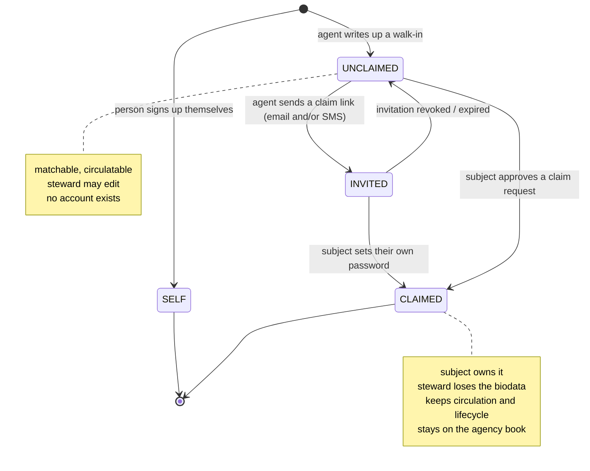
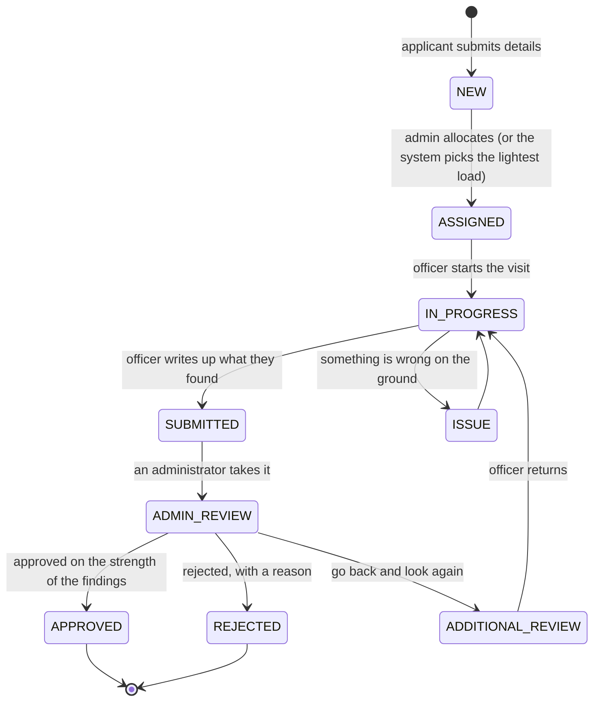
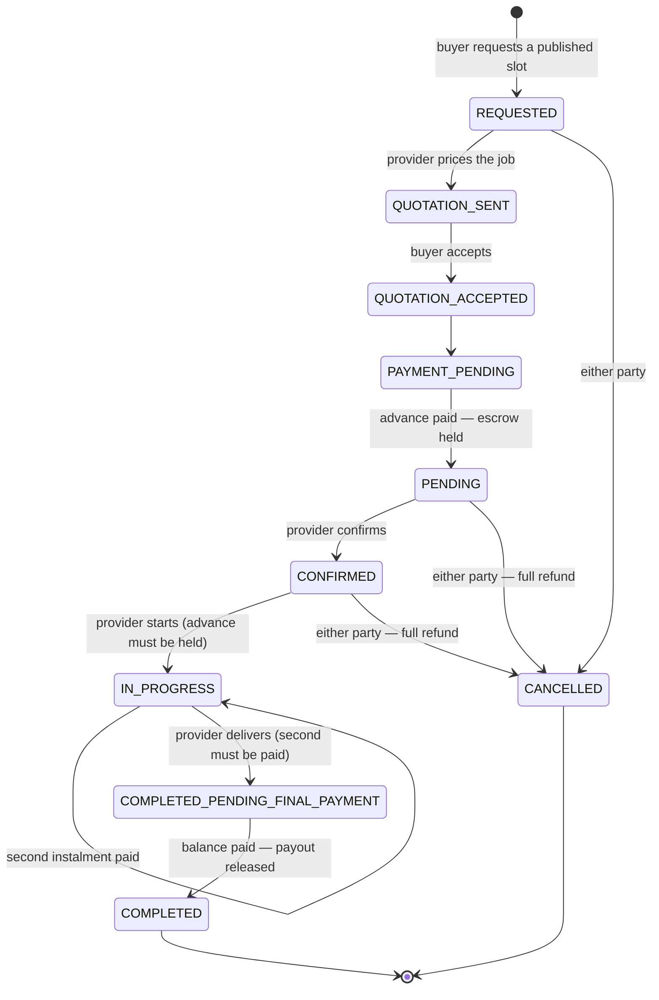
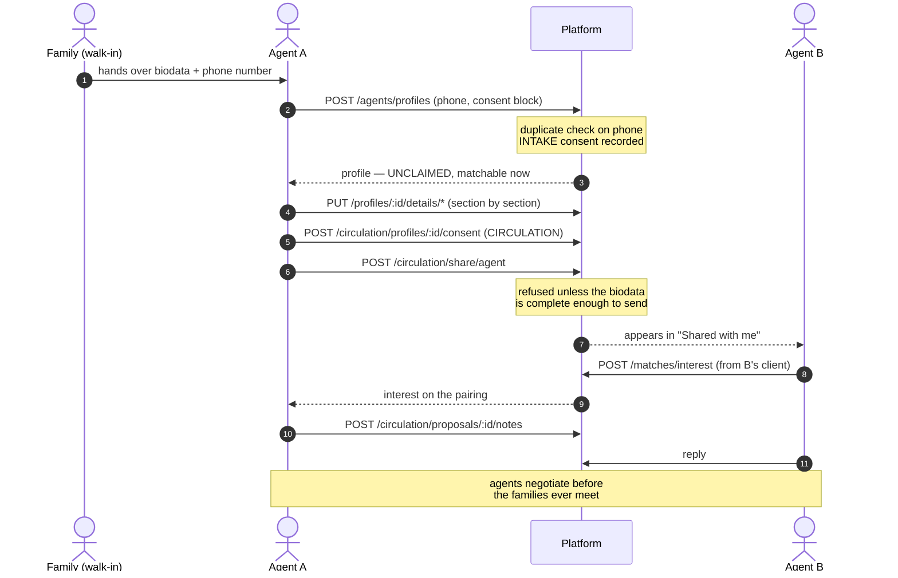
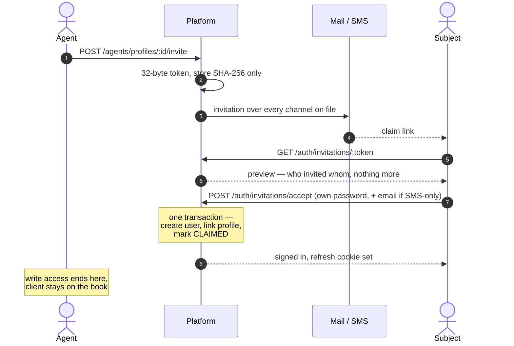
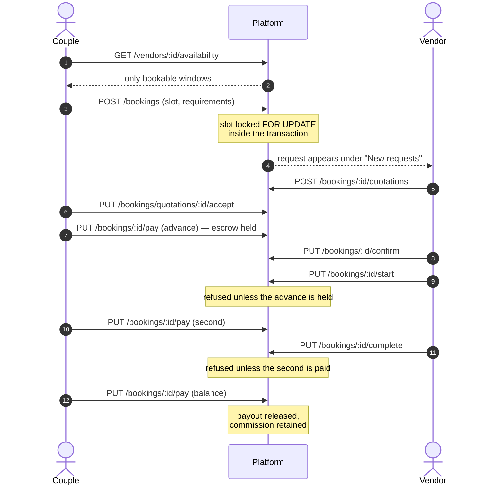
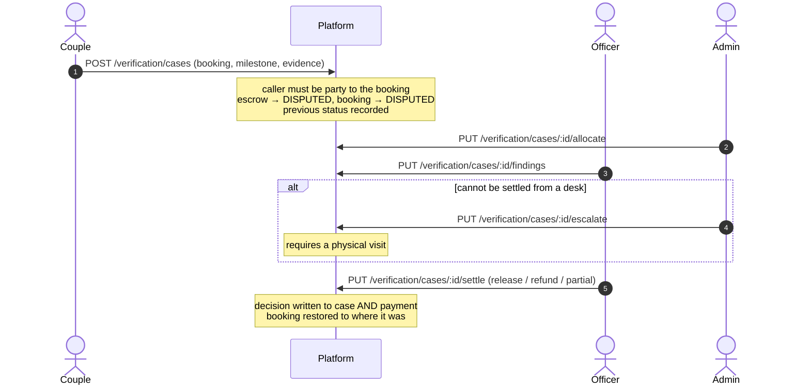

# System-level design

How the subsystems divide the work, what each owns, and how they talk to each
other. The altitude above is [HLD.md](HLD.md); below is [LLD.md](LLD.md).

---

## Contents

- [1. Module map](#1-module-map)
- [2. Identity: a profile is not an account](#2-identity-a-profile-is-not-an-account)
- [3. Authorization: two layers](#3-authorization-two-layers-that-answer-different-questions)
- [4. Consent and circulation](#4-consent-and-circulation)
- [5. Verification: the human in the loop](#5-verification-the-human-in-the-loop)
- [5.5 The service catalog](#55-the-service-catalog-configuration-instead-of-code)
- [6. Money: escrow, milestones, settlement](#6-money-escrow-milestones-settlement)
- [7. Scheduled work](#7-scheduled-work)
- [8. Communications](#8-communications)
- [9. Cross-cutting concerns](#9-cross-cutting-concerns)
- [10. End-to-end flows](#10-end-to-end-flows)

---

## 1. Module map

Twenty domain modules and eleven platform modules. Platform modules are
global — any domain module can inject audit, mail or SMS without re-importing a
transport.

**Domain**

| Module | Responsibility | Routes |
| --- | --- | --- |
| `auth` | Registration, login, sessions, MFA and recovery codes, phone verification, password recovery | 24 |
| `users` | Own profile, government ID, data export and erasure | 6 |
| `profile-details` | The matrimonial biodata section by section; Aadhaar verification | 17 |
| `agents` | Agency record, managed profiles, client book, billing, claim requests | 28 |
| `invitations` | Claim tokens, account creation on accept | — |
| `circulation` | Consent, the five sharing paths, network pool, proposals, reach | 20 |
| `matchmaking` | Suggestions with filters, interests, compatibility, Match Fixed | 13 |
| `chat` | Threads, presence, REST + WebSocket, call signalling | 5 |
| `vendors` | Listings, search, time-slot availability with capacity, gated reviews | 17 |
| `catalog` | Service categories, definitions, attributes, vendor services, prices, generated booking forms | 16 |
| `wedding-planners` | Planner listings and search | 4 |
| `bookings` | Lifecycle, quotations, escrow milestones, earnings, webhooks | 16 |
| `verification` | Field verification requests, officers, findings and review, support cases, settlements | 24 |
| `planner` | Wedding plan, timeline, tasks | 7 |
| `events` | Ceremonies, guests, RSVP links and tracking, per-event vendors | 16 |
| `media` | Albums, presigned upload, profile photos, shared links | 7 |
| `travel` | Destinations, honeymoon packages, itineraries | 5 |
| `notifications` | Fan-out from domain events; unread counts | 4 |
| `admin` | Approvals, analytics, disputes, audit | 13 |
| `ai` | Budget insight, recommendations, assistant | 4 |

**Platform**

| Module | Responsibility |
| --- | --- |
| `audit` | Append-only privileged-action trail, with alerting on the events worth waking somebody for |
| `mail` | log / smtp providers, templates |
| `sms` | log / http providers. Phone-first intake made this the channel that actually reaches a family |
| `jobs` | Five scheduled maintenance tasks |
| `throttling` | Redis storage, per-account tracker |
| `redis` | Cache-aside helper, raw client |
| `events` | Transactional outbox + processor |
| `messaging` | Kafka publisher (optional) |
| `neo4j` | Graph-ranked suggestions (optional) |
| `health` | Liveness and readiness probes |
| `websocket` | Redis Socket.io adapter |

### 1.1 Dependency rules

- A domain module may import another domain module's **service**, never its
  repositories directly, and never its internals.
- Cross-module writes that would need a shared transaction go through the
  **outbox** instead.
- Four cycles are broken explicitly with `forwardRef`: bookings ↔ verification
  (a case freezes a booking; settling one restores it), matchmaking ↔ agents
  (an agent acts as a client; a fixed match settles the agency fee), vendors ↔
  catalog (the catalog proves ownership against `vendors`; availability reads a
  service to know a window's capacity) and bookings ↔ catalog (a request is
  validated against the form it was generated from).
- `UsersModule` deliberately does **not** import `AgentsModule`, because
  `AgentsModule → VerificationModule → UsersModule` would close a cycle. The
  subject-side claim routes therefore live in a controller inside
  `AgentsModule` rather than on the users controller.

---

## 2. Identity: a profile is not an account

This is the load-bearing idea. `users` holds credentials and a persona;
`profiles` holds a marriage profile. Either can exist without the other: a
vendor has an account and no marriage profile, and an agent-built profile has no
account until — and unless — its subject claims it.

`profiles.userId` is therefore **nullable**, which forces the second decision:
**matchmaking keys on profile ids, not user ids**.
`interests.fromProfileId` / `toProfileId` is what lets a profile with no account
behind it send and receive interests from the day it is written up. Bookings
still key on accounts, because escrow needs a real account to refund to.



Claiming is optional; a great many profiles stay agent-managed forever.

Claiming does not end the engagement. The family hired the agency to find a
match, and the subject getting an account of their own is usually the point at
which that work matters most — so circulation, photographs and the profile's
lifecycle all survive it. What the agency loses is the biodata itself, because
two writers with no rule about who wins produces a profile that contradicts
itself, and the ability to delete, because a claimed profile *is* somebody's
account profile.

### 2.1 Two routes into CLAIMED, because there are two real situations

**Invitation** is the ordinary path: the agent sends a link, the subject follows
it and sets a password. It goes by email, by SMS, or by both — and an invitation
that travels by SMS alone collects the email address at the moment the person
claims the account, because an account needs one and the agent may never have
had it.

**Claim request** exists for the case that used to strand an agent's work
entirely: the agent takes the family's details at the office, and the son signs
up himself that evening. The invitation is then refused as a duplicate address
and there is nothing to join the two. A claim request lets the agent *ask*; the
subject decides. It is never a transfer — an agent asserting "this profile is
yours" is a claim about a real person's identity, and only that person can
settle it.

Approving replaces the untouched profile registration seeded from the sign-up
form. A profile the subject has actually filled in is refused instead: two real
profiles is a merge, which is a harder problem, and silently picking one loses
the other.

---

## 3. Authorization: two layers that answer different questions

Controllers declare a *capability*, never a list of roles. A 51-entry matrix
maps each role to its permissions, so adding a persona is one row rather than a
sweep across twenty-one controllers.

But a guard cannot answer *is this particular record theirs?* — that needs a
database read. So there are two layers, and skipping the second is precisely
what produced the IDOR defects listed in [SELF-REVIEW.md](SELF-REVIEW.md).

| Layer | Question it answers | Lives in | Example refusal |
| --- | --- | --- | --- |
| `PermissionsGuard` | May this *kind* of account attempt this at all? | One global guard | A bride calling `/bookings/:id/complete` |
| Service check | Is *this* record theirs? | Each domain service | Vendor B completing vendor A's booking |

Ownership itself is written in a small number of places, and every path routes
through one of them. That is the rule that keeps the system auditable:

| Choke point | Grants | Used by |
| --- | --- | --- |
| `MatchmakingService.resolveSubject` | Act *as* a profile — own it, steward it, or admin | Every matchmaking path |
| `AgentsService.assertManages` | Act for a client *account* | Plans, client reads, agency billing |
| `SharingService.circulatable` | Circulate a profile — control it, hold consent, **and** have a complete biodata | All five circulation paths |
| `ProfileDetailsService.editable` | Edit a biodata — own it or steward it | Every biodata section |
| `SupportCasesService.disputableBooking` | Dispute a booking — be a party to it | Raising a case against a booking |

The last one was added after a defect: raising a case freezes escrow, and
nothing checked the caller was party to the booking, so guessing a uuid froze a
stranger's money.

---

## 4. Consent and circulation

Agreeing that an agency may *hold* your details is not agreeing that they may
*pass them around*. Those are recorded as two separate scopes, and only the
second expires.

Each record captures the method, who gave it and their relationship to the
subject — in this market a parent very often speaks for the person — a callback
number, the date, the capturing agent, and notes. Records are **append-only**: a
re-confirmation writes a new row, so the history of what was agreed survives.

| Scope | Covers | Expires | Blocks what |
| --- | --- | --- | --- |
| `INTAKE` | The agency holding and using the details internally | never | Creating the profile at all |
| `CIRCULATION` | The profile leaving the agency, by any route | 365 days, configurable | All five paths below |

Circulation itself is five operations. Every one checks consent, produces a
**revocable record**, and grants **read only** — never edit, never act-as.

| # | Path | Recipient |
| --- | --- | --- |
| 1 | Share with an agency | Another approved agent, who can propose from their own book |
| 2 | Share with a user | A family that already has an account and is looking themselves |
| 3 | Biodata link | Anyone with the link — no account. The WhatsApp case. |
| 4 | Network pool | Every approved agency, by search |
| 5 | Printed biodata | The same link, rendered for paper |

**Withdrawal genuinely withdraws.** Revoking circulation consent pulls the
profile out of the network pool in the same transaction, and kills links already
in the wild — because consent is re-checked when a link is *opened*, not only
when it is created. The agency can always answer *who has seen my client's
details*, including whether each link was ever opened, and whether anything came
of it.

### 4.1 Two gates that are easy to confuse

Completeness gets asked twice, about the same profile, for different reasons:

| Question | Gate | Asks for |
| --- | --- | --- |
| May this profile appear in matchmaking? | `profiles.profileCompleted` | Name, gender, date of birth, city |
| May this biodata be sent to another family? | `isBiodataComplete()` | Every biodata section except identity |

Someone may reasonably browse for matches with the basics. Nobody should be
sending a biodata to strangers with the family section empty, because the first
thing the other side does is ask and the agent has nothing to say. Both are
computed from what is stored rather than tracked as flags, so neither can drift
from the truth.

### 4.2 The pool is a common resource

Any approved agency can put any consented profile into the shared pool, and
nothing stopped one agency from putting its entire book in. There is now a
per-agency quota, and a nightly job de-lists a profile a week before its
circulation consent lapses — so it leaves the pool *before* permission runs out
rather than after.

Full detail in [CIRCULATION.md](CIRCULATION.md).

---

## 5. Verification: the human in the loop

Registration grants an account, not operational access. An agency that wants to
onboard clients, and a vendor or planner that wants to appear in search, is
visited by a verification officer first.



Four separations make this a control rather than a formality:

1. **An officer reports; somebody else decides.** SUBMITTED and ADMIN_REVIEW
   are the two states that make that true. Without them an officer could
   approve a business straight from ASSIGNED, and the whole step is a checkbox.
2. **An approval cannot rest on nothing.** It is refused outright until
   findings exist — a visit somebody actually made and wrote up.
3. **An officer cannot allocate to themselves.** Choosing your own visits is
   not an allocation.
4. **A rejection requires a reason.** Anything other than an approval refuses a
   blank remark.

Findings are structured — visited, observations, issues, evidence,
recommendation — because "what did you see" and "why are you rejecting this" are
different questions that were collapsing into one remarks field.

Sending a request back clears the findings and returns it to the officer's
queue, and the revisits are counted: a third visit usually means the request is
unanswerable rather than merely incomplete, and somebody should look at why.

Allocation considers where the applicant actually is. Coverage decides the pool
— officers whose service areas include that city, then that state — and workload
decides within it, so the visit goes to the nearest officer who is not already
buried rather than to whoever happens to be free four hundred kilometres away.

Place names are matched through one canonicaliser both sides go through, since
"Hyderabad", "hyderabad " and "Hyderabad, Telangana" are one city and an
equality check reads two of them as no coverage at all. When nobody covers the
place, the allocation falls back to workload and *records that it did* — a
staffing gap nobody can see is one nobody fixes. Work an officer has *submitted* is reported but not
counted against them: their part is finished, and holding it against them would
starve the busiest officer of new work while an administrator sat on a backlog.

Allocating tells the officer, and the notification is written **after** the
allocation is stored. One written before would, on a failed save, send somebody
looking for a visit that is not on their queue.

### 5.1 Support cases and frozen money

The same officer pool investigates disputes. Raising a case against a booking
freezes the escrow *and* the booking together, and only a recorded settlement
moves either. That is what makes escrow a control rather than a label.

A case carries which instalment it disputes and the evidence behind it — "they
never turned up" and "the album is three months late" are arguments about
different money. A case nobody can settle from a desk is escalated explicitly,
which routes it to somebody who will go and look rather than leaving it circling
in a queue.

Settlement restores the booking to where it stood before the freeze, which is
why the previous status is recorded when the case is raised: a dispute raised
mid-job ends with the job still mid-job.

---

## 5.5 The service catalog: configuration instead of code

A wedding needs trades nobody thought to list. The obvious way to serve them is
a module per type — one for catering, one for photography, one for priests —
and it does not survive contact with the tenth trade: ten booking forms, ten
pricing rules, ten sets of validation, all subtly different and none of them
searchable together.

So a service type is data. Five tables, and a validator that makes storing the
answers as jsonb safe:

```
ServiceCategory → ServiceDefinition → ServiceAttribute
                        ↓
                  VendorService → ServiceOffering
```

| Table | Owned by | Holds |
| --- | --- | --- |
| `service_categories` | Admin | Photography, Catering, Priest, Transportation |
| `service_definitions` | Admin | A sellable thing, plus which pricing models it allows, how it takes time, and whether it is sold as a package at all |
| `service_attributes` | Admin | The questions. SERVICE scope asks the vendor; BOOKING scope asks the buyer |
| `vendor_services` | Vendor | Their answers, and how many they can run at once |
| `service_offerings` | Vendor | What it costs |

Three decisions carry the design.

**The definition constrains the vendor.** A venue is sensibly per-day; a caterer
is per-person; a priest sells one ceremony rather than three tiers. Encoding
that on the definition is what stops a listing nobody can read.

**The validator is the price of jsonb.** Every answer is checked against the
attribute that asked for it before it is written. Without that, "guest count"
becomes 250, "250" and "around 250" in three rows and nothing can filter on it
again. A number arriving as a string from a form is coerced; an unknown key is
dropped rather than rejected, so an administrator retiring a question does not
turn every listing that still carries its answer into a 400.

**The form is generated from the rows the validator uses.** A form the client
renders and a payload the server accepts cannot drift, because they are the same
configuration read twice.

Nothing is ever deleted once anything references it. Retiring means
`active = false`, which stops a category appearing on new listings while leaving
every booking already made under it readable — and withdrawing a pricing model
vendors are still selling on is refused outright, because the alternative is a
listing they cannot edit for reasons the error does not explain.

`concurrentCapacity` on a vendor service is where "five catering teams" and "one
convention hall" are actually recorded, and it seeds the capacity of every
window published against that service — which is the join between this section
and the calendar.

---

## 6. Money: escrow, milestones, settlement

A booking is an explicit state machine in which **money and work alternate**,
each step gated on the one before it.



A wedding job cannot be priced from a listing, which is why the flow starts with
a quotation rather than an amount. Re-quoting supersedes rather than edits, so
the history of what was offered survives.

- **A booking holds a published time slot**, reserved under a row lock inside
  the same transaction that creates it. Two buyers racing for the last Saturday
  afternoon serialise, and the second is refused with the id of the booking that
  won — so the client can open the request they already have.
- **Commission is fixed at payment time** and stored on the payment row, so what
  a provider is owed cannot drift if the rate changes later.
- **Idempotency.** `PUT /bookings/:id/pay` accepts an idempotency key, so a
  retried request returns the original payment rather than opening a second
  escrow hold.
- **Webhooks verify an HMAC over the raw request body** and drop replays via a
  Redis key — but they never drive the state machine. They record what the
  gateway said; the transitions stay under the authorization rules.
- **Reviews are gated on a completed booking** with that provider, and you
  cannot review your own listing.

### 6.1 Agency fees

Separate from the marketplace entirely, and deliberately so. The agency fee has
its own capability (`AGENCY_FEE_PAY`) rather than borrowing `BOOKING_PAY` —
which is not fastidiousness: when the agent's marketplace permissions were
removed, fee collection broke precisely because the two had been conflated.

Fees are held in escrow and released when the outcome they were charged for has
happened — the agency is paid for a fixed match, not for effort.

---

## 7. Scheduled work

Five jobs, in `platform/jobs`. Cron runs on every replica and there is no leader
election, so each is written to be idempotent instead: deletes key on a
timestamp, updates are conditional, and nothing is written twice in a way that
matters.

| Job | Cadence | What it does |
| --- | --- | --- |
| Prune expired | nightly | Expired refresh sessions and spent phone codes. `pruneExpired` existed for a long time and nothing called it, so the session table grew without bound. |
| Reconcile payments | hourly | Compares our payment status against the gateway's and **raises** a mismatch. |
| Milestone reminders | daily | Chases a booking that has stalled at a payment step for three days, by notification and SMS. |
| De-list lapsing consent | nightly | Pulls a profile out of the network pool a week before its circulation consent expires. |
| Purge stale profiles | weekly | Removes closed, unclaimed profiles past the retention limit. |

**None of them corrects anything by itself.** The reconciliation job is the one
worth explaining: it would be easy to make it fix the divergence, and that would
be a mistake. An automated process that moves money on a schedule with nobody
watching turns one bad gateway response into a hundred wrong refunds before
anybody notices. Raising it costs a human five minutes and cannot cause an
incident.

---

## 8. Communications

Four channels, and the choice between them is a design decision rather than a
preference.

| Channel | Carries | Why |
| --- | --- | --- |
| **Email** | Verification, password reset, invitations, provisioned credentials, RSVP | Universal, free, and the only place a long link is comfortable |
| **SMS** | Invitations, phone verification, provisioned credentials, milestone reminders | Intake is phone-first. A walk-in family often has no email at all, and until SMS existed they were unreachable through a platform they had just been added to. |
| **In-app notifications** | Booking updates, interests, reminders, claim requests | Everything that only makes sense inside the product |
| **Chat and calling** | Person to person | Contact details are redacted before storage, so the conversation stays on the platform until both sides choose otherwise |
| **Booking chat** | Buyer and provider, about one job | Opens when the advance is held; read-only once the job ends, because what was agreed in it is what a dispute turns on. Same redaction and the same message store as above — what differs is who may open one and when |

### 8.1 Chat, presence and calling

Chat is REST plus a Socket.io gateway behind the Redis adapter, so delivery
works across replicas. The gateway re-reads role and status from the database on
connect, and validates its payload explicitly — the global pipe is HTTP-only.

**Presence** is a Redis key with a short TTL refreshed by heartbeat, not a
boolean flag. The failure mode of a flag is somebody appearing online forever
after their laptop lid closed: the socket never disconnects cleanly, the flag
never clears, and the other family waits for a reply from a green dot. A key
that expires on its own is wrong for at most ninety seconds.

**Calling** is WebRTC. The server carries the offer, the answer and the ICE
candidates, and then gets out of the way — the media goes browser to browser.
Call authorization reuses the chat rule exactly: if you may not message
somebody, you may not ring them. The honest consequence is that a call behind a
symmetric NAT will not connect without a TURN relay; the ICE configuration comes
from the environment, and a call that cannot traverse says so rather than
ringing forever. The relay credentials are minted per call and expire, because
whatever is in that configuration reaches every browser that starts one.

---

## 9. Cross-cutting concerns

| Concern | Mechanism | Guarantee |
| --- | --- | --- |
| Audit | `audit_events` | Append-only. `record()` never throws — losing a trail row must not fail the action it describes. Accepts a transaction manager so it commits with the action. |
| Alerting | Structured `warn` on six audit actions | Money leaving escrow, an account suspended, a settlement, a reconciliation mismatch, a recovery code used. Deliberately a log line rather than an outbound call: a paging provider having a bad day must not be able to fail an escrow release. |
| Domain events | `outbox_events` | Written inside the business transaction, drained by a processor. No lost events, no two-phase commit. |
| Rate limiting | Redis + `AccountThrottlerGuard` | Counters are shared, so the configured limit is the real limit however many replicas run. Keyed by user id when signed in, IP otherwise. The auth surface has its own tighter ceiling. |
| Caching | Redis cache-aside | Vendor and planner search, match suggestions, profile reads. Invalidated on write by key pattern; the suggestion key includes the filters, or a filtered request would return the previous unfiltered page. |
| Mail / SMS | log / real providers behind one interface | `log` needs no credentials and prints the link or code, so every flow is testable locally. |
| Data rights | Export and erasure | Export is complete rather than readable. Erasure deletes the personal record and anonymises the account, because bookings and audit rows reference it and orphaning them would break the financial record. |

---

## 10. End-to-end flows

Four sequences carry most of the system's weight.

### 10.1 Walk-in intake through to a cross-agent proposal

No account exists for the family at any point in this diagram.



### 10.2 Invitation and claim

The steward never sees or sets the password, which is the point.



### 10.3 A booking, from request to released money



### 10.4 A dispute freezing the money



---

## Companion documents

- [HLD.md](HLD.md) — what the system is and why.
- [LLD.md](LLD.md) — tables, routes, algorithms, configuration.
- [RBAC-AND-ROLES.md](RBAC-AND-ROLES.md) — the authorization contract in full.
- [CIRCULATION.md](CIRCULATION.md) — intake and the five circulation paths.
- [PROFILES-AND-INVITATIONS.md](PROFILES-AND-INVITATIONS.md) — stewardship and claiming.
